# 建立與設定 Azure Mobile App 行動應用服務

這裡有兩種方法可以建立 Azure Mobile App Service，若您對於 Azure Mobile App 不孰悉的話，建議您使用第二個作法。

## 方法一：使用 Web + 行動 > Moibl App 建立 Azure Mobile App

在這裡我們需要建立一個 Azure Mobile App Server來提供我們後端的資料存取服務。

* 打開瀏覽器，輸入網址 [https://azure.microsoft.com](https://azure.microsoft.com) ，接著輸入登入之帳號與密碼，進入到Microsoft Azure 儀表板

* 在 Microsoft Azure 儀表板頁面左上方，找到 `+ 新增` 區域，點擊這個連結

* 在 `新增` 刀鋒視窗中，選擇 `Web + 行動`

* 在 `Web + 行動` 刀鋒視窗中，選擇 `Mobile App`

  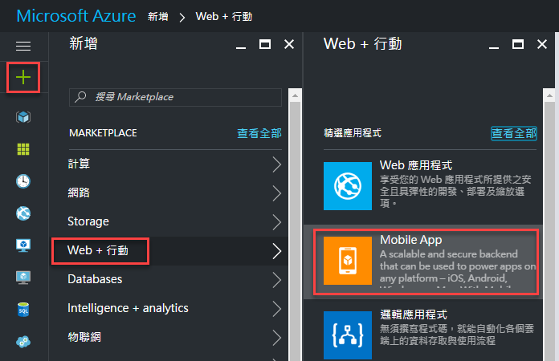

* 在 `Mobile App` 刀鋒視窗中，依序輸入 `應用程式名稱` / `訂戶名稱` / `資源群組` / `App Service 方案/位置`，下圖為這個練習所建立的 `Mobile App` 資訊。

  應用程式名稱 : XamarinHandsOnLab

  資源群組(新建)： DoggyXamarin

  App Service 方案/ DoggyXamarinAsiaAppService / Southeast Asia

  定價層：F1免費

  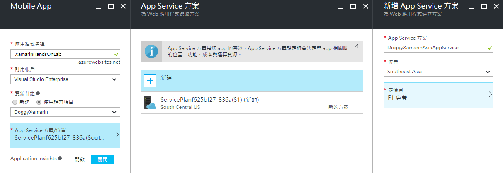

  >  關於 `應用程式名稱 : XamarinHandsOnLab` 在整個 Azure 系統下，必須是一個唯一的名稱，因此，您需要在此輸入一個屬於您自己的應用程式名稱。若在這本電子書之後內容若出現了 `XamarinHandsOnLab` 關鍵字，請您要更換成為您在此輸入的 `應用程式名稱`
  > 
  >  關於 `資源群組` 您可以使用您Azure系統內現有的資源群組，若您的 Azure 平台下尚未有任何資源群組定義，您需要選擇新建一個資源群組。
  > 
  >  若您想要購買任何 Azure 方面的服務或者產品，歡迎您與 [多奇數位創意有限公司](http://bit.ly/2rtqAnY) 聯繫。

* 在 `Mobile App` 刀鋒視窗下，點選 `釘選到儀表板`，

* 接著點 `建立` 按鈕，完成建立這個 Azure Mobile App 服務

* 您需要等候一段時間，Azure 會進行部署相關服務到特定機器上。

## 方法二：使用 Mobile Apps Quickstart 建立 Azure Mobile App

在這裡，我們使用 Azure 提供的 `Mobile App 快速入門` 應用程式，來快速幫我們建立起這一個後端資料庫存取服務

* 打開瀏覽器，輸入網址 [https://azure.microsoft.com](https://azure.microsoft.com) ，接著輸入登入之帳號與密碼，進入到Microsoft Azure 儀表板

* 在 Microsoft Azure 儀表板頁面左上方，找到 `+ 新增` 區域，點擊這個連結

* 在 `新增` 刀鋒視窗中，請在搜尋文字輸入盒內(有 搜尋Marketplace 文字處)，輸入 `Mobile Apps`

* 請在 `Everything` 刀鋒視窗中，點選 `Mobile Apps Quickstart` 這個項目

  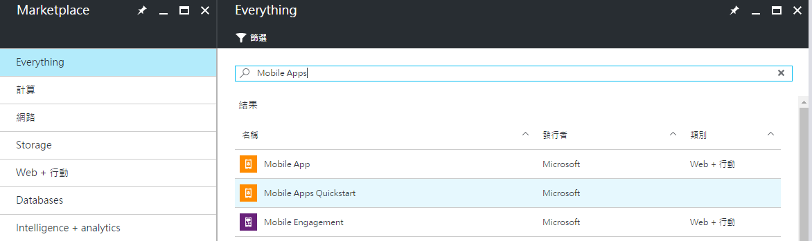

* 在 `Mobile Apps Quickstart` 刀鋒視窗中，請點選 `建立` 按鈕

  底下為這個刀鋒視窗中顯示的說明文字：

  Accelerate your mobile app development with this ready-to-use Mobile App todo sample. Azure Mobile Apps uses Azure App Service to provide a turnkey way to store structured data, authenticate users, and send push notifications. With native and cross-platform SDKs for iOS, Android, Windows, and JavaScript, as well as a powerful and flexible REST API, Azure Mobile Apps empowers you to build connected applications for any platform and deliver a consistent experience across devices.

  * Pre-configured for a basic SQLite database
  * Connect to on-premise or Azure-hosted SQL databases
  * Authenticate users via Azure Active Directory, Facebook, Google, Microsoft and Twitter
  * Push notifications via Apple, Google and Microsoft services
  * Gain insights with mobile analytics
  * Auto-scale to millions of devices

* 在新出現的刀鋒視窗中，請依序填入底下欄位所需要的內容

  應用程式名稱 : XamarinHandsOnLab 
  
  (請依照您的需求，填入您想要的應用程式名稱)

  資源群組(使用現有項目)： DoggyXamarin

  (您可以新建或者選擇使用現有項目)

  App Service 方案/ DoggyXamarinAsiaAppService / Southeast Asia

  定價層：F1免費

  (這裡可以依照您的需求來選取或定義)

  底下為這個練習範例所建立的 `Mobile Apps Quickstart` 資訊

  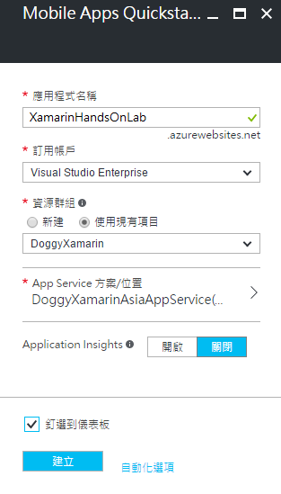

  >  關於 `應用程式名稱 : XamarinHandsOnLab` 在整個 Azure 系統下，必須是一個唯一的名稱，因此，您需要在此輸入一個屬於您自己的應用程式名稱。若在這本電子書之後內容若出現了 `XamarinHandsOnLab` 關鍵字，請您要更換成為您在此輸入的 `應用程式名稱`
  > 
  >  關於 `資源群組` 您可以使用您Azure系統內現有的資源群組，若您的 Azure 平台下尚未有任何資源群組定義，您需要選擇新建一個資源群組。
  > 
  >  若您想要購買任何 Azure 方面的服務或者產品，歡迎您與 [多奇數位創意有限公司](http://bit.ly/2rtqAnY) 聯繫。

* 最後，請勾選 `釘選到儀表板` ，並且點選 `建立` 按鈕

* 您需要等候一段時間，Azure 會進行部署相關服務到特定機器上。

* 當這個服務建立完成之後，會出現底下刀鋒視窗 `XamarinHandsOnLab / Mobile Apps Quickstart`

  最上方中間的那個圖示 `xamarinazurequickstart 行動App` 就是這個後端服務設定入口點。

  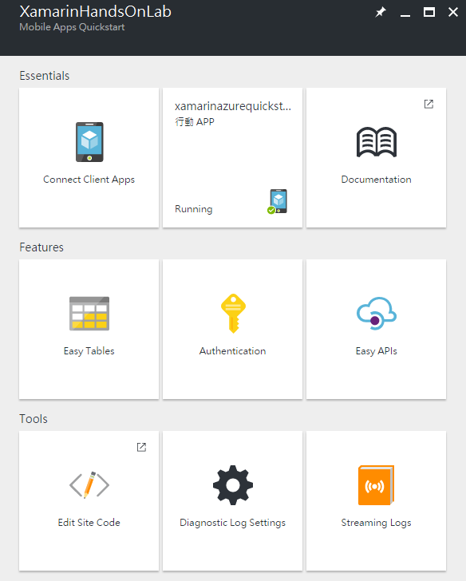 

## 建立 Azure 行動應用要用到的 SQL 資料庫

在這裡，我們將會使用剛剛建立的 `XamarinHandsOnLab` App Service 來進行設定要存取的後端資料庫。

* 首先，開啟 Microsoft Azure 找到 `XamarinHandsOnLab 行動App` ，並且開啟它

* 在 `XamarinHandsOnLab` 刀鋒視窗中，找到 `快速入門` 項目，點選這個 `快速入門` > `Xamarin.Forms`

  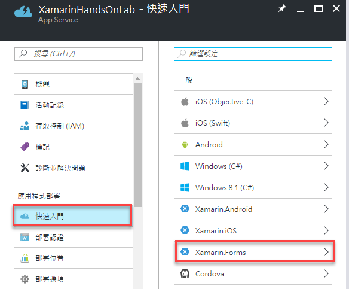

* 在 `Xamarin.Forms 快速入門` 刀鋒視窗中，點選 `連結資料庫` 下方的區塊

  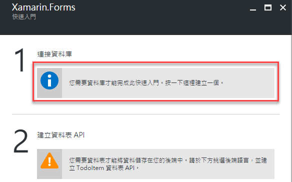

* 在 `資料連接` 刀鋒視窗中，點選 `+ 新增` 按鈕

  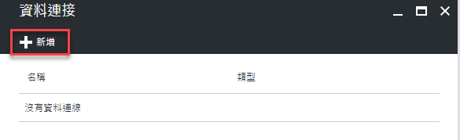

* 在 `新增資料連線` 刀鋒視窗中，類型欄位，選擇 `SQL Database`

* 點選 `SQL Database 設定必要設定`

* 在 `資料庫` 刀鋒視窗中，點選 `建立新的資料庫`

* 在 `SQL Database` 刀鋒視窗中，找到
 
  名稱欄位，請輸入 `XamarinAzureTasksDB` 

  定價層欄位，請選擇 `B基本` (這種資料庫主機服務為：最多 2GB / 異地複寫 / 還原時間點 7 天 / 稽核，預設為 S0 標準方案)

  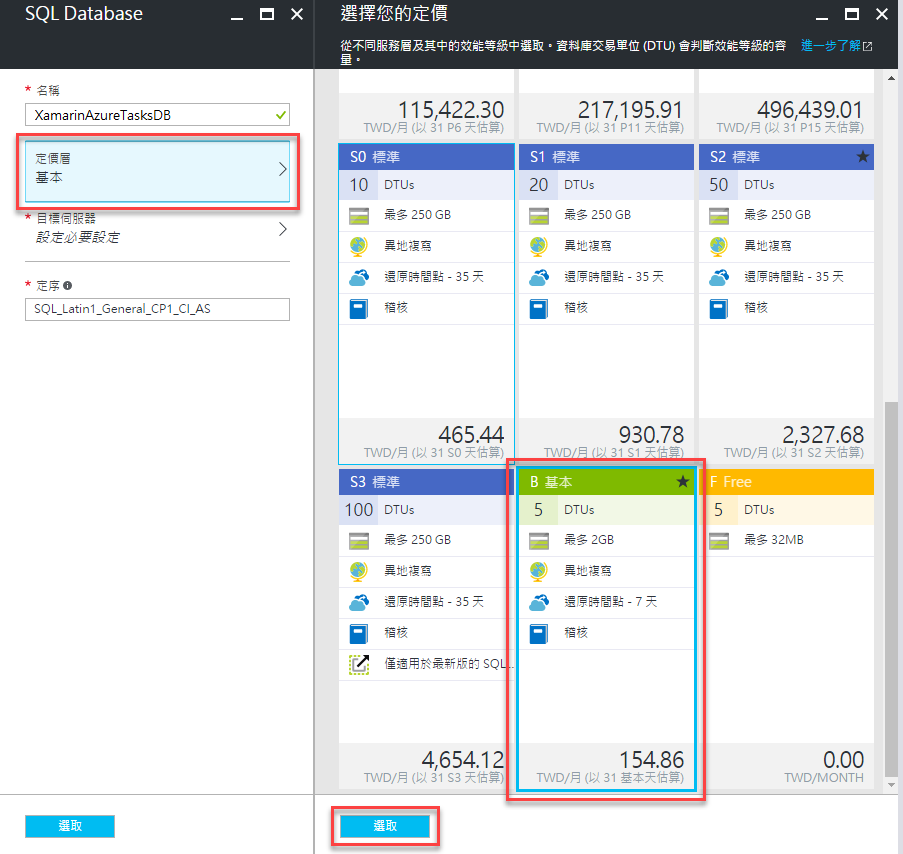

  目標伺服器欄位，在這裡，我們新建立一個測試用的資料庫伺服器，使用設定參數如下：

  * 伺服器名稱：XamarinAzureSQLServer

  * 伺服器管理員登入：`請在這裡填入您想要的 SQL Server 管理員帳號`

  * 密碼：`請在這裡填入該SQL Server管理員的密碼`

  * 位置：東南亞

  * 允許 AZURE 服務存取此伺服器：請勾選這個項目

  * 點選 `選取` 按鈕

    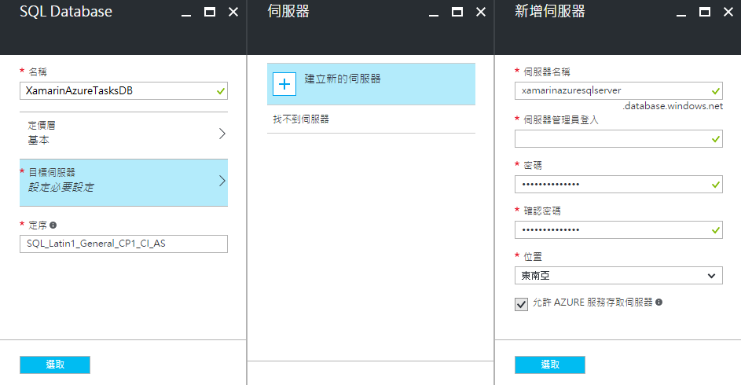 

  >  關於 `伺服器名稱：XamarinAzureSQLServer` 在整個 Azure 系統下，必須是一個唯一的名稱，因此，您需要在此輸入一個屬於您自己的伺服器名稱。若在這本電子書之後內容若出現了 `XamarinAzureSQLServer` 關鍵字，請您要更換成為您在此輸入的 SQL Server `伺服器名稱`
  > 

  再回到 `SQL Database` 刀鋒視窗後，點選該視窗下方的 `選取` 按鈕 

  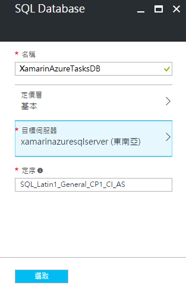

* 當回到 `新增資料連線` 刀鋒視窗中，點選 `連接字串` 下方區域

* 在 `連接字串` 刀鋒視窗中，點選 `確定` 按鈕

* 當回到 `新增資料連線` 刀鋒視窗中，點選 `確定` 按鈕

  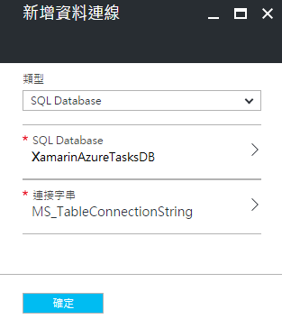

  這個時候，Azure 會開始建立 SQL Server 主機與資料庫，請稍後片刻。

* SQL Server 與 資料庫建立完成之後，會看到如下畫面。

  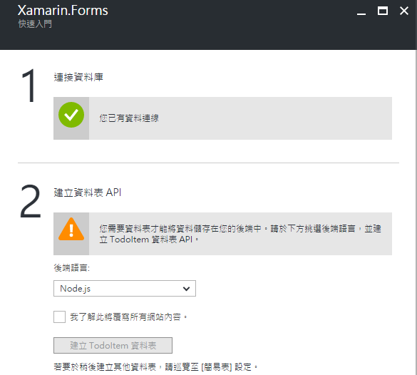

## 完成 Azure Moible App 行動應用服務的安裝與設定

 恭喜您，您已經完成了Azure Moible App 行動應用服務的安裝與設定，也就是說，您可以開始進行後端 Web API 服務的開發，並且可以佈署到 Azure 上，讓 Xamarin.Forms App 透過網路存取這些 Web API；而，這些 API 的資料，將會使用 Azure SQL Server 服務，把資料存放到 Azure 上。
