# 確認 Azure Mobile App 行動應用服務是正常運作

接下來，我們需要進行確認剛剛建立的 Azure Mobile App 行動應用服務是已經正常且可以運作的；在這裡，我們將會透過 Azure Mobile App 行動應用服務所提供的 ASP.NET (後端 Web API) 專案 / Xamarin.Forms (前端 跨平台App) 專案，來實際進行建置、佈署，已進行確認工作。

## 下載後端伺服器使用的 ASP.NET 專案與發佈到 Azure 上

* 您可以接續上一個步驟繼續接下來的動作，或者，先回到 Azure 儀表板首頁，找到 `XamarinHandsOnLab 行動 APP` 圖示，點選這個圖示

  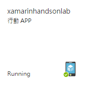

* 接著，從 `XamarinHandsOnLab App Service` 刀鋒視窗中，點選 `快速入門` > `Xamarin.Forms`

  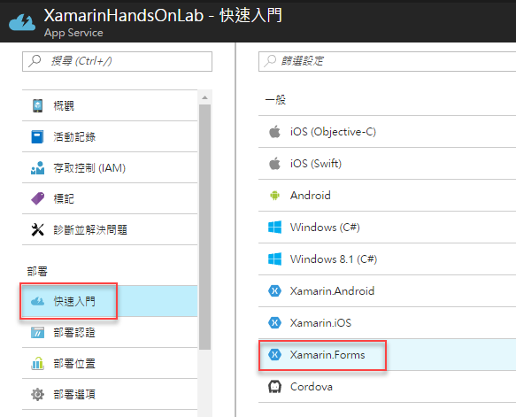

* 現在，您應該可以看到如下圖的內容，請在 `2.建立資料表 API` 區塊來進行操作 
  
  設定 `後端語言` 為 `C#`

  點選 `下載` 按鈕，下載後端專案原始碼

  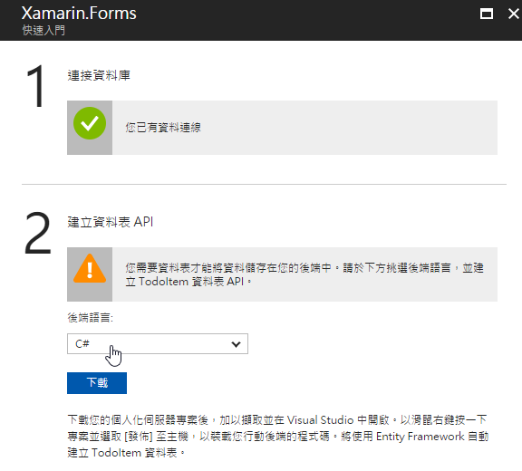 

* 下載該後端專案原始碼專案之後，請解壓縮到您電腦中的目錄內。

## 本機執行與確認 API 服務運作正常

* 在這裡，您可以打開這個 ASP.NET 的專案，建置並確認沒有問題發生

* 接著，請直接執行這個 Web API 專案，確認他可以順利執行與運作

* 當這個專案成功執行之後，會有瀏覽器頁面開啟，若您看到的如下圖畫面，那就表示這個專案可以順利在本機上執行。

  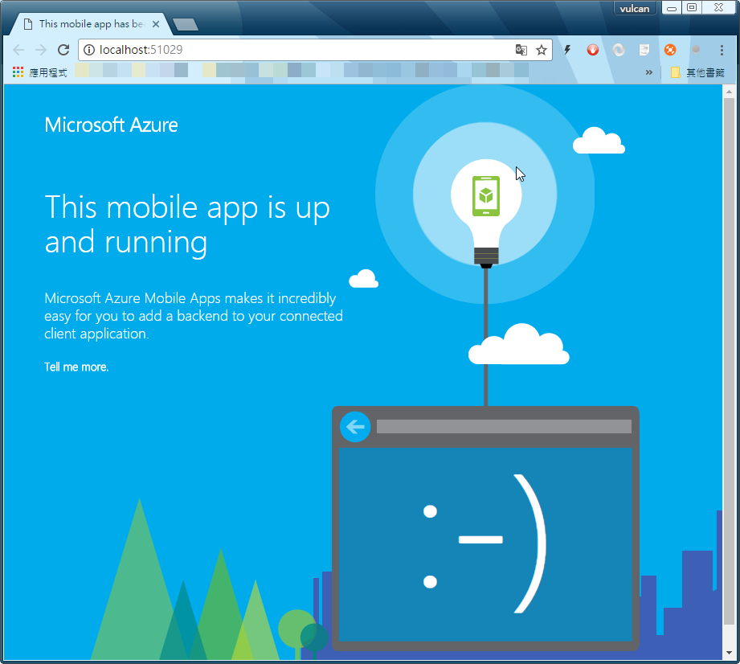

### 如何確認本機的 Web API 服務是正常運作的呢?

* 在這裡，我們將會使用 PostMan 來做為展示說明，當然，您也可以在 C# 中實際使用這個方法來呼叫。

  >  關於這個練習中的所有 PostMan 設定，您可以從 [XamarinHandsOnLab GitHub](https://github.com/vulcanlee/XamarinHandsOnLab) 中的 `PostMan` 目錄下，找到 [XamarinHandsOnLab.postman_collection.json](https://github.com/vulcanlee/XamarinHandsOnLab/blob/master/PostMan/XamarinHandsOnLab.postman_collection.json) 檔案，就可以直接匯入到 PostMan 
  >
  > 若想要匯入上述的 PostMan定義，請點選 PostMan 視窗左上方的 `Import` 按鈕
  >
  > 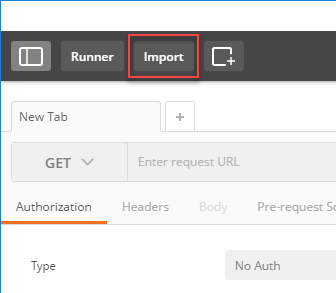
  >
  > 當 Import 對話窗出現之後，請點選 `Choose Files` 或者將 `XamarinHandsOnLab.postman_collection.json` 檔案拖拉到這個對話窗中，就可以完成匯入的動作
  >
  > 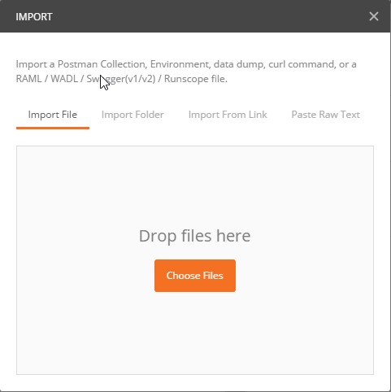 
  >
  > 一旦匯入完成之後，您就可以在 PostMan 中，看到已經定義好了各個測試 Web API 的呼叫作業。
  >
  > 下圖是這個專案在 Azure 上所實作出來的各個 Web API 的服務
  >
  > 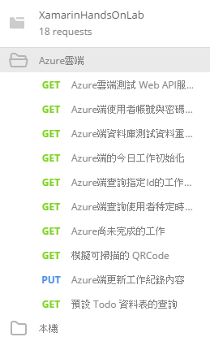
  >
  > 下圖是這個專案在本機上運行的各個 Web API 的服務
  >
  > 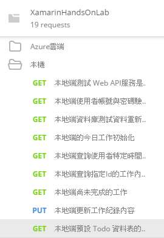

* 在剛剛開啟的瀏覽器頁面中，我們可以看到這個 Web API 的首頁 URL 是 `http://localhost:51029/`

  >  您所產生的 ASP.NET Web API 專案，所使用的 Port 號碼，可能會與這篇文章的不同，因此，請以您電腦上所看到的 URL 為主

* 打開您的 PostMan App 

* 請選擇 `Get` 方法，在網址列填入 `http://localhost:51029/tables/todoitem`

  > 其中， `http://localhost:51029/` 是剛剛開啟的瀏覽器頁面中複製下來的網址。

* 在 Header 頁次中，輸入 Key 為 `ZUMO-API-VERSION` / value 為 `2.0.0`

* 點選最右方的 `Send` 藍色按鈕，就可以查詢到這個代辦清單表格內的所有資料。

  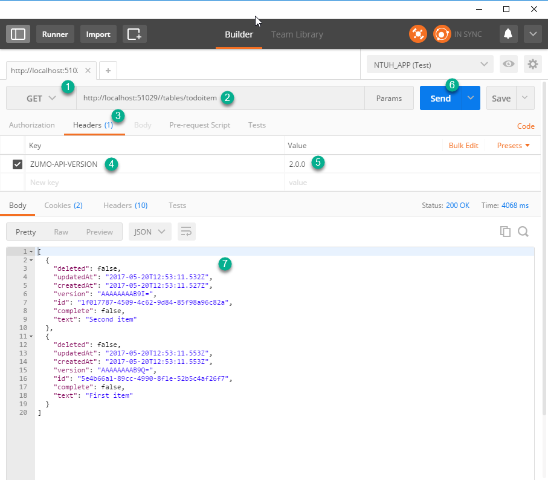

## 測試與佈署到 Azure 上

* 在這裡，您可以打開這個 ASP.NET 的專案，建置並確認沒有問題發生

* 滑鼠右擊專案 `XamarinHandsOnLabService`，選擇 `發行`

* 在 `發行` 對話窗，在設定檔中點選 `Microsoft Azure App Service`

  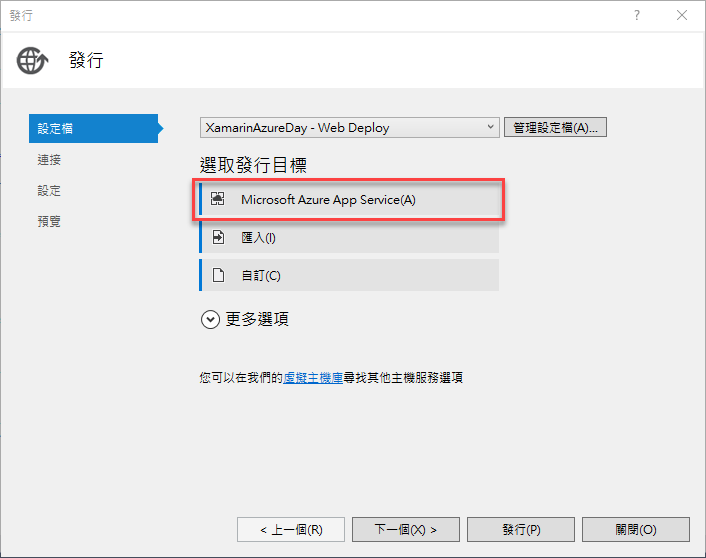

* 在 `App Service` 對話窗中，選擇剛剛建立的 App Service 方案，也就是 `DoggyXamarin` > `XamarinHandsOnLab`

  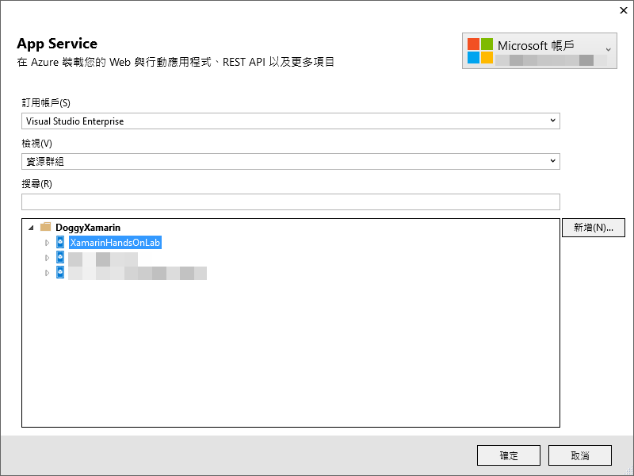

* 點選 `確定 按鈕

* 在 `連接` 頁次，此時，會出現如下圖的對話窗內容，點選 `驗證連接` 按鈕，以進行是否可以正常連線與佈署到 Azure 上。

  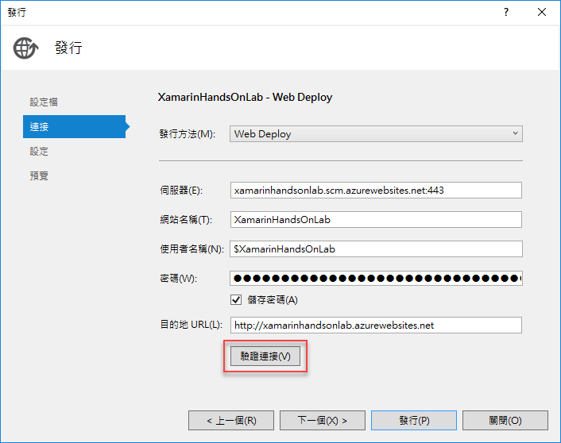

* 若 `驗證連接` 成功，此時會出現 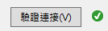，接著，點選 `發行` 按鈕

* 此時，您 Azure 上的後端 API 服務，將會有這個專案來取代

  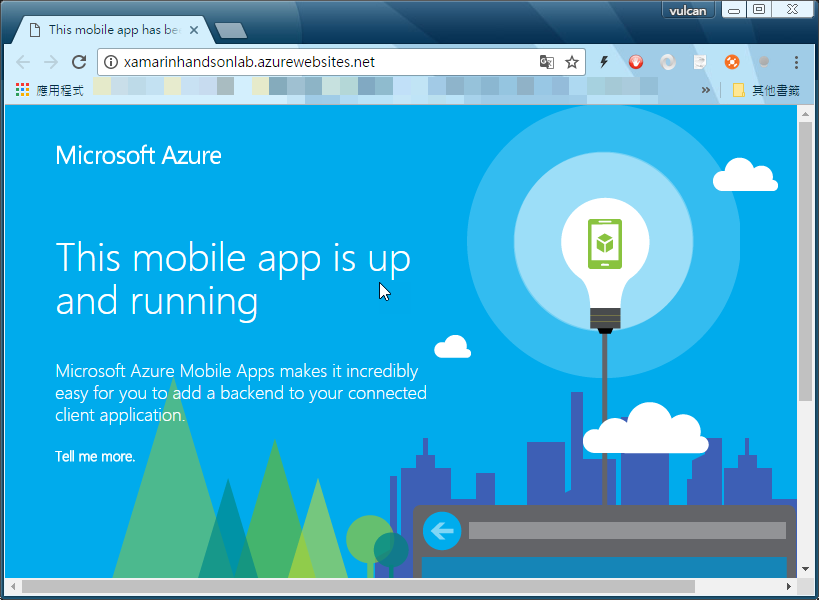

* 打開您的 PostMan App 

* 請選擇 `Get` 方法，在網址列填入 `http://xamarinhandsonlab.azurewebsites.net/tables/todoitem`

  > 其中， `http://xamarinhandsonlab.azurewebsites.net/` 是剛剛開啟的瀏覽器頁面中複製下來的網址。

* 在 Header 頁次中，輸入 Key 為 `ZUMO-API-VERSION` / value 為 `2.0.0`

* 點選最右方的 `Send` 藍色按鈕，就可以查詢到這個代辦清單表格內的所有資料。

  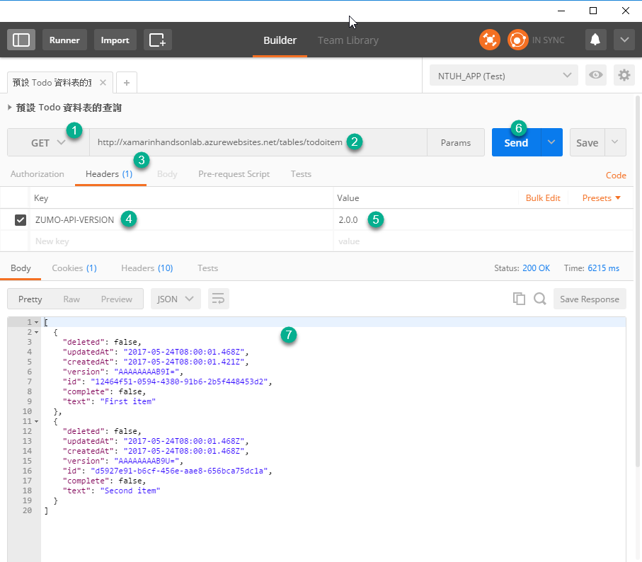

### 修正 Code First Migration 轉移設定

由於這個產生的 ASP.NET 專案，採用的是 Entity Framework Code First 開發技術，因此，我們需要針對這個專案做些修正，也就是要進行 `Code First Migrations` 的動作；相關更詳細的說明，可以參考 [How to make data model changes to a .NET backend mobile service](https://github.com/Azure/azure-mobile-services/blob/master/docs/mobile-services-dotnet-backend-how-to-use-code-first-migrations.md) 這篇文章。

* 請在 ASP.NET Web API 專案內，選擇功能表 `Tools` > `NuGet 封裝管理員` > `套件管理器主控台`

  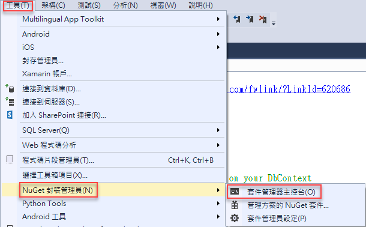

* 在 `套件管理器主控台` 內，輸入 `Enable-Migrations`，這樣，便可以開啟您專案的 Code First Migrations 能力。

  

* 一旦執行完成之後，您就會在 `套件管理器主控台` 內看到底下的訊息文字

```
Checking if the context targets an existing database...
Detected database created with a database initializer. Scaffolded migration '201705240756200_InitialCreate' corresponding to existing database. To use an automatic migration instead, delete the Migrations folder and re-run Enable-Migrations specifying the -EnableAutomaticMigrations parameter.
```

* 接著，請在 `套件管理器主控台` 內，輸入 `Add-Migration Initial` 命令，這樣將會產生一個新的名為 Initial 的 Migration，而在您的專案內，將會有個 `Migrations` 目錄自動產生出來。

  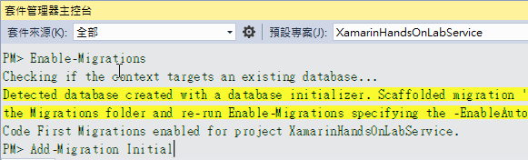 

* 一旦執行完成之後，您就會在 `套件管理器主控台` 內看到底下的訊息文字

```
Scaffolding migration 'Initial'.
The Designer Code for this migration file includes a snapshot of your current Code First model. This snapshot is used to calculate the changes to your model when you scaffold the next migration. If you make additional changes to your model that you want to include in this migration, then you can re-scaffold it by running 'Add-Migration Initial' again.
```

* 最後，請在 `套件管理器主控台` 內，輸入 `Update-Database` 並且按下 Enter 執行這個命令

  > 相關進階使用說明，可以參考文件 [Package Manager Console (Visual Studio)](https://docs.microsoft.com/en-us/ef/core/miscellaneous/cli/powershell)

* 下圖是在 Visual Studio 專案內所產生的資料夾與相關檔案畫面截圖

  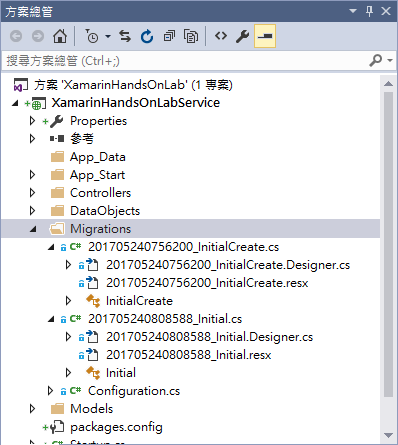 

* 請在 ASP.NET Web API 專案 `XamarinHandsOnLabService` 下的目錄 `App_Start` 找到 `Startup.MobileApp.cs` 檔案，開啟它。

* 找到 `Database.SetInitializer(new XamarinHandsOnLabInitializer());` 這行程式碼，將其註解起來。

* 在剛剛註解起來的程式碼下方，更新成為底下程式碼：

```csharp
            // Use Entity Framework Code First to create database tables based on your DbContext
            // 請註解底下這行程式碼，因為，我們要使用接下來的兩行程式碼來取代
            //Database.SetInitializer(new XamarinHandsOnLabInitializer());

            var migrator = new DbMigrator(new Migrations.Configuration());
            migrator.Update();

            // To prevent Entity Framework from modifying your database schema, use a null database initializer
            // Database.SetInitializer<XamarinHandsOnLabContext>(null);

```

* 進行 `DbMigrator` 的錯誤修正，加入適當的命名空間 `using System.Data.Entity.Migrations;`

* 按下 `F5` 開始在本機執行這個專案，看看是否可以正常在本機上執行

* 若沒有問題，滑鼠右擊專案 `XamarinHandsOnLabService`
  
  在 `發行` 對話窗中，點選 `設定` 標籤頁次，請勾選 `執行 Code First 轉移 (在應用程式啟動時執行)` 選項。

  最後，選擇 `發行` 按鈕

  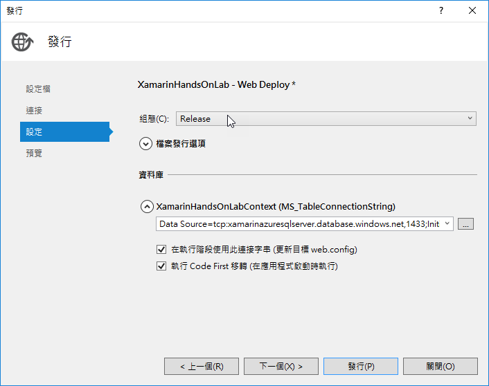

* 您應該要看到底下瀏覽器畫面

  

## 下載 Xamarin.Forms 用戶端專案

* 您可以接續上一個步驟繼續接下來的動作，或者，先回到 Azure 儀表板首頁，找到 `xamarinazureday 行動 APP` 圖示，點選這個圖示；接著，從 `XamarinAzureDay App Service` 刀鋒視窗中，點選 `快速入門` > `Xamarin.Forms`

* 現在，您應該可以看到如下圖的內容，，請在 `3.設定您的用戶端應用程式` 區塊來進行操作
  
  請點選 `下載` 按鈕，下載 Xamarin.Forms 專案檔案

  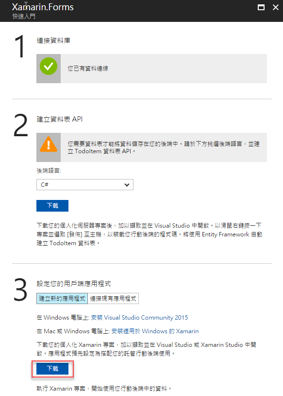

* 下載該 Xamarin.Forms 專案原始碼專案之後，請解壓縮到您電腦中的目錄內。

* 若您點選了 `連接現有應用程式` 則會出現底下內容，告訴您如何在您現有的專案中，加入 `Microsoft.Azure.Mobile.Client` 並且經建立適當程式碼，就可以存取您的 Azure Mobile App 後端服務了。

  >  我們這個練習將會採用這個方法來進行 Xamarin.Forms 的專案開發，所以，等下的練習，將會帶領帶大家來做這樣的操作。

  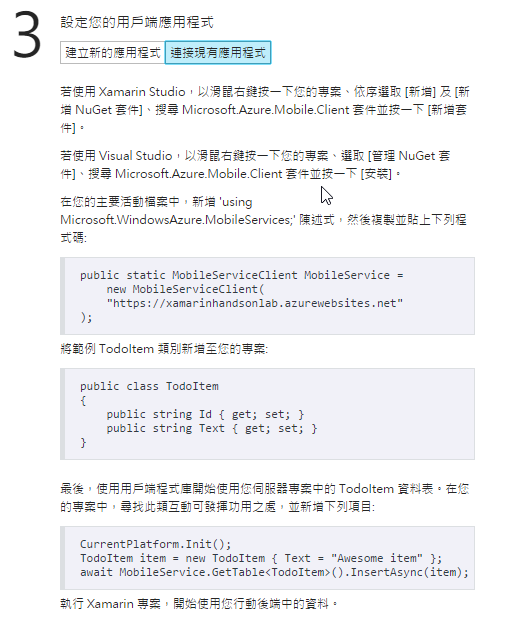

## 測試 Xamarin.Forms 專案

在這裡需要實際執行與測試 Azure Mobile App 所提供的 Xamarin.Forms 專案，看看是否可以正常連線到 Azure 上。
  
* 請打開您剛剛下載的 Xamarin.Forms 專案，使用 Visual Studio 2015 打開 `XamarinHandsOnLab.sln` 檔案。 

* 滑鼠右擊 Android 原生專案 ( `XamarinHandsOnLab.Droid` )，選擇，`設定為起始專案`

* 按下 `F5` 開始進行這個 Xamarin.Forms 專案偵測

* 此時，您可以在電腦中的 Android 模擬器中，這個應用程式實際執行結果，如同看到底下畫面

  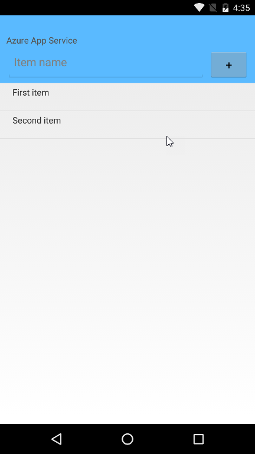  

* 您也可以實際在 `Item name` 欄位中輸入代辦工作事項名稱，接著點選右方 ` + ` 按鈕，此時，這筆紀錄就會儲存到遠端 Azure SQL Server 上了


