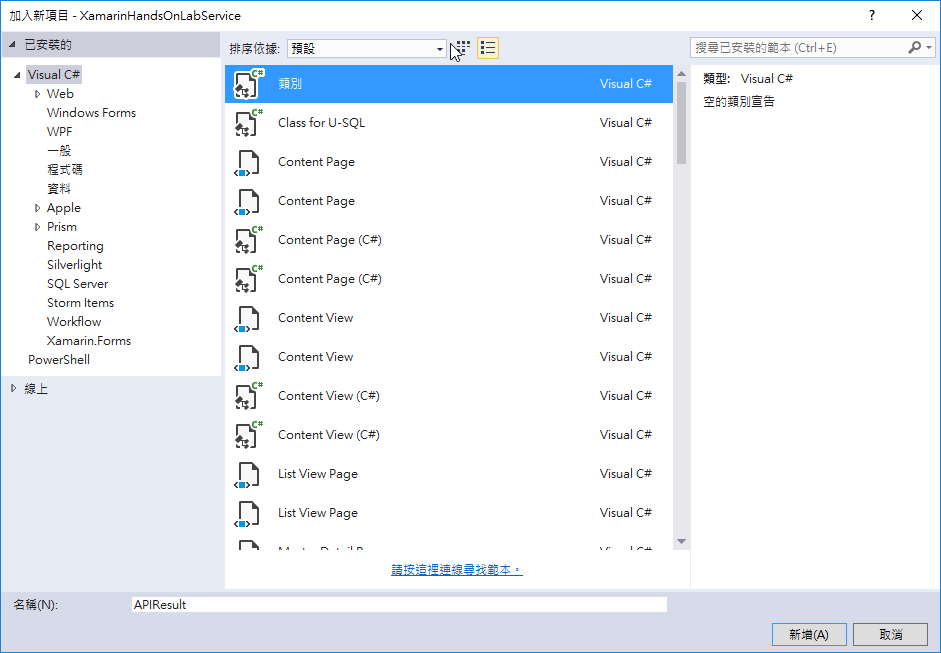
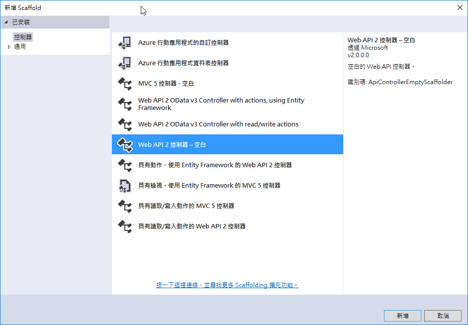
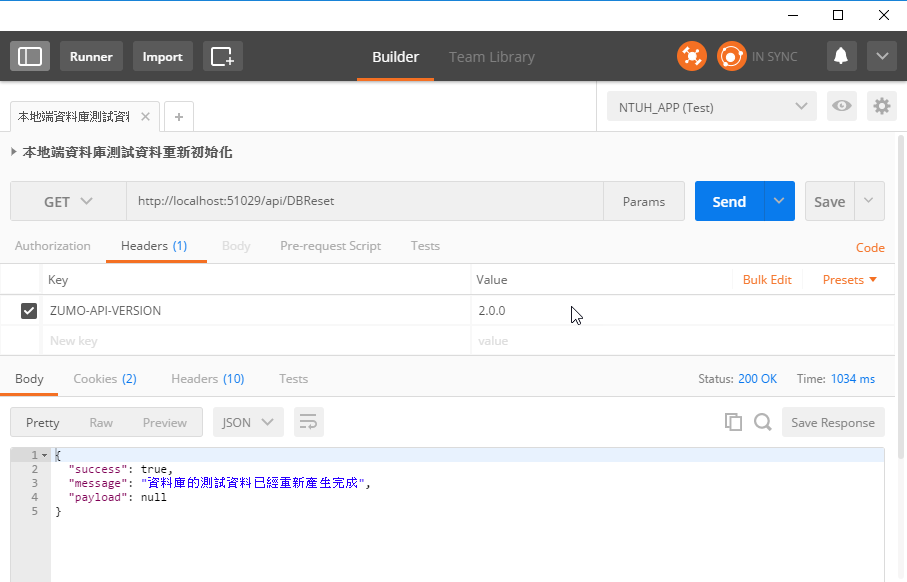
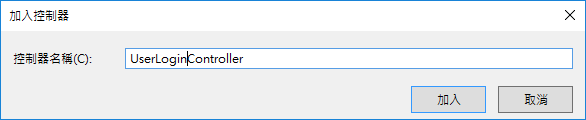
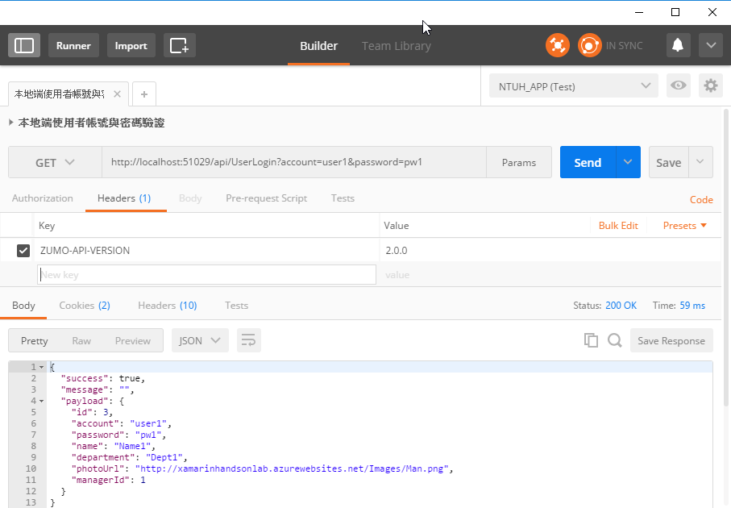
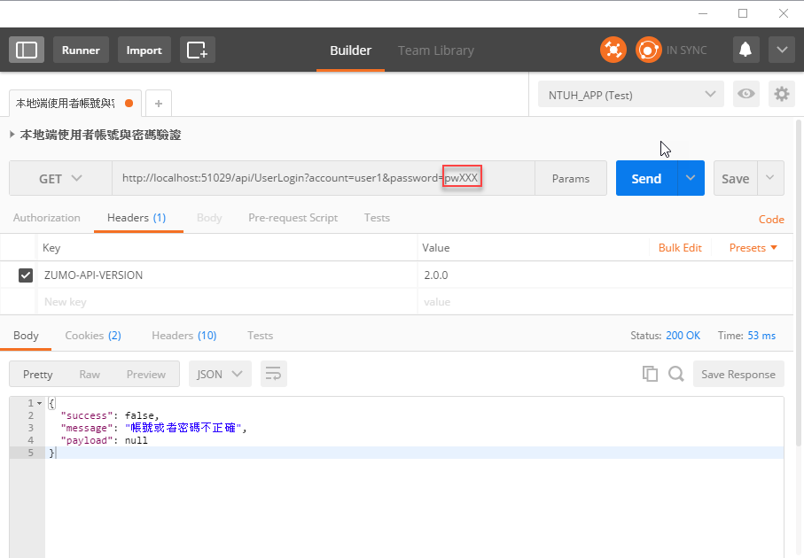
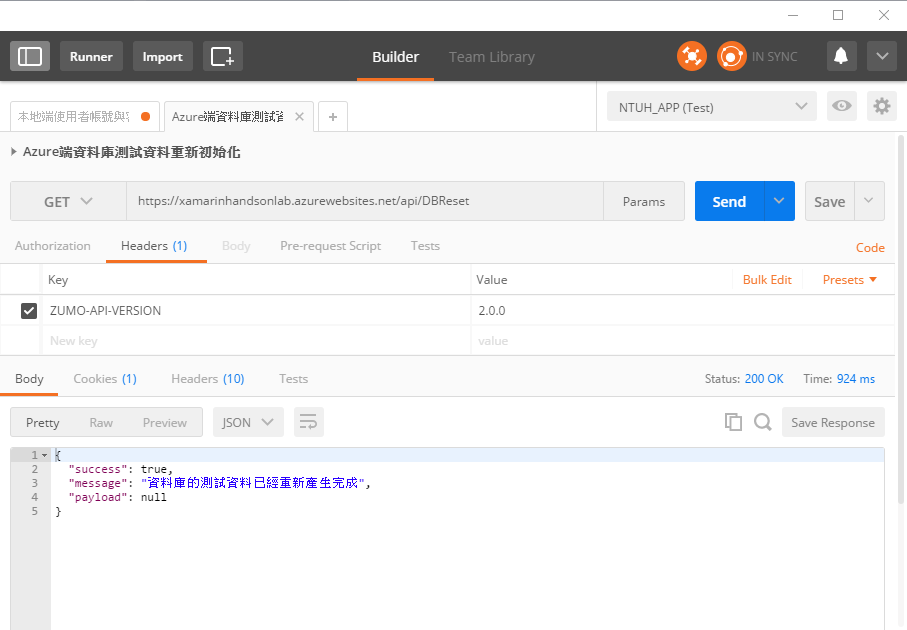
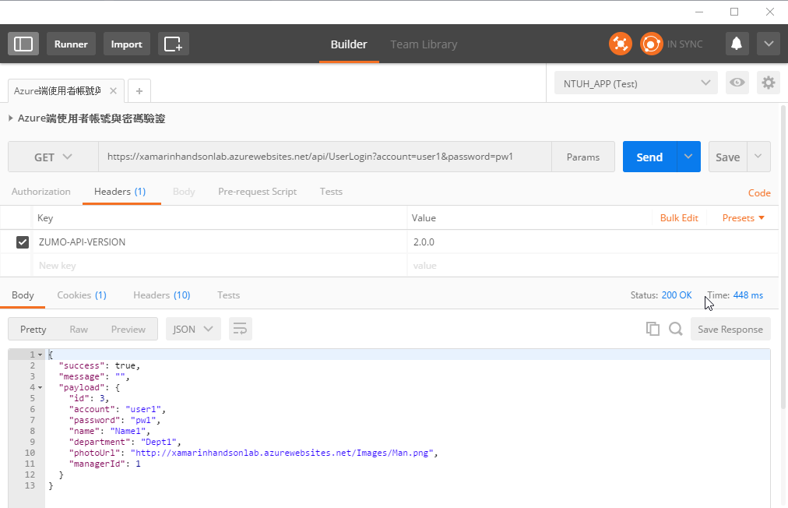
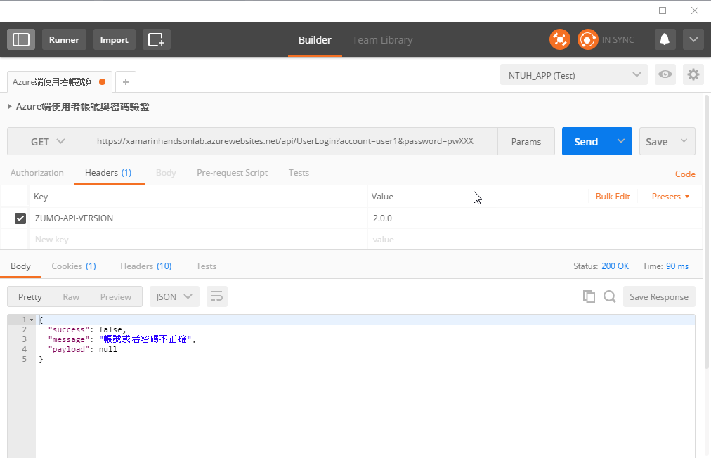

# 建立使用者登入驗證之服務 Web API

根據這個實作練習的需求定義，我們需要透過後端 Web API 能夠取得相關派工紀錄，讓手機使用者，根據取得的派工紀錄，進行後續相關處理；最後，透過手機將這些工作處理過程，回報到後端 Web API 主機上。

不過，在使用這些功能之前，使用者必須要能夠先在手機上進行身分驗證的登入動作，一旦使用者身分驗證成功，接下來，就可以根據使用者的身分，進行相關的派工紀錄處理。

## 設計所有 Web API 要回傳的 JSON 格式 (APIResult 類別)

在這個專案中，當您呼叫完成這個 Web API 之後，所有的處理結果，將會依照統一的格式，將資料回傳給手機端，因此，我們先進行這個回傳結果的資料模型定義。

* 請滑鼠右擊 `Models` 目錄，選擇 `加入` > `類別`

* 在 `加入新項目 - XamarinHandsOnLabServer` 對話窗內，選擇 `已安裝的` > `Visual C#` > `類別`

* 在 `加入新項目 - XamarinHandsOnLabServer` 對話窗下方的 `名稱` 欄位，輸入 `APIResult`

* 點選右下方的 `新增` 按鈕

  

* 在剛剛建立好的 `APIResult.cs` 檔案中，輸入底下程式碼；這個類別定義的每個欄位，都有註解說明這些欄位的用途，原則上，我們會把呼叫 Web API 所取得的物件，存放在 `Payload` 這個欄位上；當透過 ASP.NET 回傳到手機上的 Xamarin.Forms 應用程式時候，將會以 JSON 格式回傳回去。

```csharp
    /// <summary>
    /// 呼叫 API 回傳的制式格式
    /// </summary>
    public class APIResult
    {
        /// <summary>
        /// 此次呼叫 API 是否成功
        /// </summary>
        public bool Success { get; set; } = true;
        /// <summary>
        /// 呼叫 API 失敗的錯誤訊息
        /// </summary>
        public string Message { get; set; } = "";
        /// <summary>
        /// 呼叫此API所得到的其他內容
        /// </summary>
        public object Payload { get; set; }
    }
```

## 建立使用者資料模型與相關 Web API

接下來，讓我們來產生兩個使用者資料表會用到的 Web API， 一個是自動建立要測試的使用者帳號紀錄，另外一個是要撰寫使用者登入之身分驗證服務功能。

我們首先來撰寫這個系統會用到的資料表初始化的 API 服務。

當我們呼叫這個 API 之後，將會清空使用者與派工紀錄中的所有紀錄，接著，會產生預設的資料到資料庫內，這樣，可以方便我們進行 Xamarin.Forms 專案開發的時候，可以有實際資料用來進行測試與驗證之用。

因此，我們需要在 SQL Server 上建立這兩個資料表，而由於我們使用的 Entity Framework 的 Code First 方式開發，所以，我們需要先建立出定義這兩個資料表的資料模型

### 定義使用者資料模型 (Users 類別)

* 請滑鼠右擊 `DataObjects` 目錄，選擇 `加入` > `類別`

* 在 `加入新項目 - XamarinHandsOnLabServer` 對話窗內，選擇 `已安裝的` > `Visual C#` > `類別`

* 在 `加入新項目 - XamarinHandsOnLabServer` 對話窗下方的 `名稱` 欄位，輸入 `Users`

* 點選右下方的 `新增` 按鈕

* 在剛剛建立好的 `Users.cs` 檔案中，輸入底下程式碼；這個類別定義的每個欄位，都有註解說明這些欄位的用途。

```csharp
    /// <summary>
    /// 使用者資訊
    /// </summary>
    public class Users
    {
        /// <summary>
        /// 使用者編號
        /// </summary>
        public long Id { get; set; }
        /// <summary>
        /// 帳號
        /// </summary>
        public string Account { get; set; }
        /// <summary>
        /// 密碼
        /// </summary>
        public string Password { get; set; }
        /// <summary>
        /// 名稱
        /// </summary>
        public string Name { get; set; }
        /// <summary>
        /// 部門名稱
        /// </summary>
        public string Department { get; set; }
        /// <summary>
        /// 使用者大頭貼網址
        /// </summary>
        public string PhotoUrl { get; set; }
        /// <summary>
        /// 主管代號
        /// </summary>
        public long ManagerId { get; set; }
    }

```

### 定義派工紀錄資料模型 (UserTasks 類別)

* 請滑鼠右擊 `DataObjects` 目錄，選擇 `加入` > `類別`

* 在 `加入新項目 - XamarinHandsOnLabServer` 對話窗內，選擇 `已安裝的` > `Visual C#` > `類別`

* 在 `加入新項目 - XamarinHandsOnLabServer` 對話窗下方的 `名稱` 欄位，輸入 `UserTasks`

* 點選右下方的 `新增` 按鈕

* 在剛剛建立好的 `UserTasks.cs` 檔案中，輸入底下程式碼；這個類別定義的每個欄位，都有註解說明這些欄位的用途。關於派工紀錄的狀態，在這裡，我們使用了 `TaskStatus` 列舉型別來表示，而不是使用一般的整數，因為，當我們取的了派工紀錄的同時，可以很容易的從派工紀錄的狀態欄位中，很清楚的看出這個紀錄當時的狀態。

```csharp
    /// <summary>
    /// 指派的工作
    /// </summary>
    public class UserTasks
    {
        public long Id { get; set; } 
        /// <summary>
        /// 工作分配的帳號
        /// </summary>
        public string Account { get; set; }
        /// <summary>
        /// 工作產生時間
        /// </summary>
        public DateTime TaskDateTime { get; set; }
        /// <summary>
        /// 工作執行進度
        /// </summary>
        public TaskStatus Status { get; set; }
        /// <summary>
        /// 工作的主題
        /// </summary>
        public string Title { get; set; }
        /// <summary>
        /// 工作說明
        /// </summary>
        public string Description { get; set; }
        /// <summary>
        /// 簽到核對文字
        /// </summary>
        public string CheckinId { get; set; }
        /// <summary>
        /// 緯度
        /// </summary>
        public double Checkin_Latitude { get; set; }
        /// <summary>
        /// 經度
        /// </summary>
        public double Checkin_Longitude { get; set; }
        /// <summary>
        /// 打卡時間
        /// </summary>
        public DateTime CheckinDatetime { get; set; }
        /// <summary>
        /// 第1項子工作主題
        /// </summary>
        public string Condition1_Ttile { get; set; }
        /// <summary>
        /// 第1項子工作的回報內容
        /// </summary>
        public string Condition1_Result { get; set; }
        /// <summary>
        /// 第2項子工作主題
        /// </summary>
        public string Condition2_Ttile { get; set; }
        /// <summary>
        /// 第2項子工作的回報內容
        /// </summary>
        public string Condition2_Result { get; set; }
        /// <summary>
        /// 第3項子工作主題
        /// </summary>
        public string Condition3_Ttile { get; set; }
        /// <summary>
        /// 第3項子工作的回報內容
        /// </summary>
        public string Condition3_Result { get; set; }
        /// <summary>
        /// 工作回報的照片
        /// </summary>
        public string PhotoURL { get; set; }
        /// <summary>
        /// 該指派工作是否已經完成且回報
        /// </summary>
        public bool Reported { get; set; }
        /// <summary>
        /// 該指派工作的回報時間
        /// </summary>
        public DateTime ReportedDatetime { get; set; }
    }

    /// <summary>
    /// 工作處理進度
    /// </summary>
    public enum TaskStatus
    {
        /// <summary>
        /// 尚未開始
        /// </summary>
        NOT_START,
        /// <summary>
        /// 已經打卡
        /// </summary>
        CHECKIN,
        /// <summary>
        /// 完成資料輸入
        /// </summary>
        INPUT,
        /// <summary>
        /// 圖片已經上傳
        /// </summary>
        UPLOAD_IMAGE,
        /// <summary>
        /// 已經回報
        /// </summary>
        REPORTED,
    }

```

### 修正 XamarinHandsOnLabContext

* 請在 `Models` 目錄，打開 `XamarinHandsOnLabContext.cs` 檔案

* 在 `public DbSet<TodoItem> TodoItems { get; set; }` 程式碼之後，加入底下兩行程式碼

```csharp
        public DbSet<Users> Users { get; set; }
        public DbSet<UserTasks> UserTasks { get; set; }
```

### 建立資料庫初始化紀錄 API 服務  

* 請滑鼠右擊 `Controllers` 目錄，選擇 `加入` > `控制器`

* 在 `新增 Scaffold` 對話窗內，選擇 `已安裝的` > `控制器` > `Web API 2 控制器 - 空白`

* 點選右下方的 `新增` 按鈕

  

* 當出現 `加入控制器` 對話窗的時候，請輸入 `DBReset` 於控制器名稱欄位，也就是我們要定義的控制器類別名稱為 `DBResetController`

* 接著，請點選 `加入` 按鈕

  

* 在剛剛建立好的 `DBResetController.cs` 檔案中，輸入底下程式碼。

```csharp
    /// <summary>
    /// 將原有資料都進行刪除，並且產生新的使用者帳號
    /// 規則：
    ///    帳號名稱：user#
    ///    密碼：pw#
    /// </summary>
    [MobileAppController]
    public class DBResetController : ApiController
    {
        APIResult fooAPIResult = new APIResult();
        private XamarinHandsOnLabContext db = new XamarinHandsOnLabContext();

        public APIResult Get()
        {
            CleanAllData();
            UserInit();

            fooAPIResult.Success = true;
            fooAPIResult.Message = "資料庫的測試資料已經重新產生完成";
            fooAPIResult.Payload = null;
            return fooAPIResult;
        }

        /// <summary>
        /// 清除所有的資料
        /// </summary>
        public void CleanAllData()
        {
            // 將工作資料全部刪除掉
            db.UserTasks.RemoveRange(db.UserTasks.ToList());
            // 將使用者的資料全部刪除掉
            var fooUsers = db.Users.ToList();
            db.Users.RemoveRange(fooUsers);

            db.SaveChanges();
        }

        /// <summary>
        /// 進行使用者資料初始化
        /// </summary>
        public void UserInit()
        {
            #region 建立管理者的帳號
            var fooAdmin = new DataObjects.Users
            {
                Account = "admin",
                Password = "admin",
                Department = "總經理室",
                Name = "管理者",
                PhotoUrl = "http://xamarinhandsonlab.azurewebsites.net/Images/Admin.png",
            };
            db.Users.Add(fooAdmin);
            db.SaveChanges();
            #endregion

            fooAdmin = db.Users.FirstOrDefault(x => x.Account == "admin");
            fooAdmin.ManagerId = fooAdmin.Id;

            #region 建立四十個使用者帳號
            for (int i = 0; i < 40; i++)
            {
                var fooUser = new DataObjects.Users
                {
                    Account = $"user{i}",
                    Password = $"pw{i}",
                    Department = $"Dept{i}",
                    Name = $"Name{i}",
                    PhotoUrl = "http://xamarinhandsonlab.azurewebsites.net/Images/Man.png",
                    ManagerId = fooAdmin.Id,
                };

                if (i % 2 == 0)
                {
                    fooUser.PhotoUrl = "http://xamarinhandsonlab.azurewebsites.net/Images/Woman.png";
                }

                db.Users.Add(fooUser);
            }
            #endregion

            db.SaveChanges();
        }
    }
```

* 此時，您會看到 Visual Studio 程式碼編輯器中，會出現很多錯誤；此時，請加入底下的 `using` 程式碼：

```csharp
using Microsoft.Azure.Mobile.Server.Config;
using XamarinHandsOnLabService.Models;
```

* 您可以建置這個專案，看看有沒有其他錯誤產生

* DBResetController 裡面，只有一個 Get 服務，當執行這個服務的時候，會先執行 `CleanAllData()` 方法，這個時候，會把現在資料庫內的使用者資料表與派工紀錄資料表內的所有紀錄都全部刪除掉；接著會執行 `UserInit()` 這個方法，該方法首先會先建立一個建立管理者的帳號，並且，建立四十個測試用的使用者帳號，當然這些帳號與密碼都已經依據事先安排的規則設定好了。

* 至於 `[MobileAppController]` 屬性標示，則是註明這個 API 可以用於 Azure Mobile App client

* 當要新增一筆使用者紀錄的時候，可以使用這樣的方法呼叫 `db.Users.Add(fooUser)`，不過，當確實要將異動紀錄更新到 SQL Server 資料庫內的時候，需要執行 `db.SaveChanges()` 方法呼叫。

* 要刪除所有派工紀錄資料，這裡使用的是這個方法呼叫 `db.UserTasks.RemoveRange(db.UserTasks.ToList())`，而要刪除所有的使用者紀錄資料，則是使用這樣的方式呼叫：`var fooUsers = db.Users.ToList();db.Users.RemoveRange(fooUsers);`；不論進行哪種方式呼叫，請記得都要隨後需要執行 `db.SaveChanges()`，這樣才會更新到後端資料庫內。

### 進行 Code First Migrations

* 接著，請在 `套件管理器主控台` 內，輸入 `Add-Migration Add_Users_UserTasks_Table` 並且按下 Enter 執行這個命令

* 一旦執行完成之後，您就會在 `套件管理器主控台` 內看到底下的訊息文字

```
Scaffolding migration 'Add_Users_UserTasks_Table'.
The Designer Code for this migration file includes a snapshot of your current Code First model. This snapshot is used to calculate the changes to your model when you scaffold the next migration. If you make additional changes to your model that you want to include in this migration, then you can re-scaffold it by running 'Add-Migration Add_Users_UserTasks_Table' again.
```

* 最後，請在 `套件管理器主控台` 內，輸入 `Update-Database` 並且按下 Enter 執行這個命令

* 一旦執行完成之後，您就會在 `套件管理器主控台` 內看到底下的訊息文字

```
Specify the '-Verbose' flag to view the SQL statements being applied to the target database.
Applying explicit migrations: [201705241453224_Add_Users_UserTasks_Table].
Applying explicit migration: 201705241453224_Add_Users_UserTasks_Table.
Running Seed method.
```

* 按下 `F5` 開始在本機執行這個專案，看看是否可以正常在本機上執行

### 測試 資料庫初始化紀錄 API

* 打開您的 PostMan App 

* 請選擇 `Get` 方法，在網址列填入 `http://localhost:51029/api/DBReset`

  > 其中， `http://localhost:51029/` 是剛剛開啟的瀏覽器頁面中複製下來的網址。

* 在 Header 頁次中，輸入 Key 為 `ZUMO-API-VERSION` / value 為 `2.0.0`

* 點選最右方的 `Send` 藍色按鈕，就可以查詢到資料庫重新初始化的執行結果。

   

* 若您看到底下的 JSON 內容，那就表示您剛剛執行的 API 是正常無誤的。

```json
{
  "success": true,
  "message": "資料庫的測試資料已經重新產生完成",
  "payload": null
}
```

## 建立使用者登入驗證 API

* 請滑鼠右擊 `Controllers` 目錄，選擇 `加入` > `控制器`

* 在 `新增 Scaffold` 對話窗內，選擇 `已安裝的` > `控制器` > `Web API 2 控制器 - 空白`

* 點選右下方的 `新增` 按鈕

  

* 當出現 `加入控制器` 對話窗的時候，請輸入 `UserLogin` 於控制器名稱欄位，也就是我們要定義的控制器類別名稱為 `UserLoginController`

* 接著，請點選 `加入` 按鈕

   

* 在剛剛建立好的 `UserLoginController.cs` 檔案中，輸入底下程式碼。

```csharp
    /// <summary>
    /// 提供使用者登入、身分驗證的服務
    /// </summary>
    [MobileAppController]
    public class UserLoginController : ApiController
    {
        APIResult fooAPIResult = new APIResult();
        private XamarinHandsOnLabContext db = new XamarinHandsOnLabContext();

        // GET: api/UserLogin/5
        public APIResult Get(string account, string password)
        {
            // 依據所提供的帳號與密碼，查詢是否存在
            var fooObject = db.Users.FirstOrDefault(x => x.Account == account && x.Password == password);
            if (fooObject != null)
            {
                fooAPIResult.Success = true;
                fooAPIResult.Message = "";
                fooAPIResult.Payload = fooObject;
            }
            else
            {
                fooAPIResult.Success = false;
                fooAPIResult.Message = "帳號或者密碼不正確";
                fooAPIResult.Payload = null;
            }
            return fooAPIResult;
        }

    }
```

* 此時，您會看到 Visual Studio 程式碼編輯器中，會出現很多錯誤；此時，請加入底下的 `using` 程式碼：

```csharp
using Microsoft.Azure.Mobile.Server.Config;
using XamarinHandsOnLabService.Models;
```

* 您可以建置這個專案，看看有沒有其他錯誤產生

* 在這個 API 中，我們看到，當要進行使用者身分驗證的時候，需要傳送 帳號 `account` / 密碼 `password` 這兩值到 API 內，此時，這個驗證方法將會使用 LINQ 來查詢資料庫 `b.Users.FirstOrDefault(x => x.Account == account && x.Password == password);` 內，是否有這個帳號與密碼的存在，並且依據查詢結果，回報該使用者是否為合法使用者。

## 測試 使用者登入驗證 API

* 按下 `F5` 開始在本機執行這個專案，看看是否可以正常在本機上執行

* 打開您的 PostMan App 

* 請選擇 `Get` 方法，在網址列填入 `http://localhost:51029/api/UserLogin?account=user1&password=pw1`

  > 其中， `http://localhost:51029/` 是剛剛開啟的瀏覽器頁面中複製下來的網址。

* 在 Header 頁次中，輸入 Key 為 `ZUMO-API-VERSION` / value 為 `2.0.0`

* 點選最右方的 `Send` 藍色按鈕，就可以看到這次的使用者登入是否成功或者是失敗。

   

* 若您看到底下的 JSON 內容，那就表示您剛剛執行的 API 是正常無誤的。而且，此次身分驗證是否有成功，可以觀察 success 欄位的值；該使用者的詳細資訊，將會存在於 payload 欄位內。

```json
{
  "success": true,
  "message": "",
  "payload": {
    "id": 3,
    "account": "user1",
    "password": "pw1",
    "name": "Name1",
    "department": "Dept1",
    "photoUrl": "http://xamarinhandsonlab.azurewebsites.net/Images/Man.png",
    "managerId": 1
  }
}
```

* 接下來，讓我們故意輸入一個錯誤的密碼，看看呼叫這個 API 之後，會得到甚麼內容？

* 請選擇 `Get` 方法，在網址列填入 `http://localhost:51029/api/UserLogin?account=user1&password=pwXXX`

  > 其中， `http://localhost:51029/` 是剛剛開啟的瀏覽器頁面中複製下來的網址。

* 在 Header 頁次中，輸入 Key 為 `ZUMO-API-VERSION` / value 為 `2.0.0`

* 點選最右方的 `Send` 藍色按鈕，就可以看到這次的使用者登入是否成功或者是失敗。

  

* 若您看到底下的 JSON 內容，那就表示您剛剛執行的 API 是正常無誤的。而且此次身分驗證是否有成功，可以觀察 success 欄位的值；使用者登入失敗的說明原因文字，將會存在於 message 欄位中。

```json
{
  "success": false,
  "message": "帳號或者密碼不正確",
  "payload": null
}
```

## 發佈到 Azure 上，並且進行測試

### 發佈到 Azure 上

* 按下 `Shift+F5` 停止偵錯

* 滑鼠右擊專案 `XamarinHandsOnLabService`，選擇 `發行`

* 在 `發行` 對話窗，點選 `發行` 按鈕

* 此時，您 Azure 上的後端 API 服務，將會有這個專案來取代

  

### 測試 資料庫初始化紀錄 API

* 打開您的 PostMan App 

* 請選擇 `Get` 方法，在網址列填入 `https://xamarinhandsonlab.azurewebsites.net/api/DBReset`

  > 其中， `https://xamarinhandsonlab.azurewebsites.net/` 是剛剛開啟的瀏覽器頁面中複製下來的網址。

* 在 Header 頁次中，輸入 Key 為 `ZUMO-API-VERSION` / value 為 `2.0.0`

* 點選最右方的 `Send` 藍色按鈕，就可以查詢到這個代辦清單表格內的所有資料。

   

### 測試 使用者登入驗證 API

* 請選擇 `Get` 方法，在網址列填入 `https://xamarinhandsonlab.azurewebsites.net/api/UserLogin?account=user1&password=pw1`

  > 其中， `https://xamarinhandsonlab.azurewebsites.net/` 是剛剛開啟的瀏覽器頁面中複製下來的網址。

* 在 Header 頁次中，輸入 Key 為 `ZUMO-API-VERSION` / value 為 `2.0.0`

* 點選最右方的 `Send` 藍色按鈕，就可以看到這次的使用者登入是否成功或者是失敗。

    

* 若您看到底下的 JSON 內容，那就表示您剛剛執行的 API 是正常無誤的。而且，此次身分驗證是否有成功，可以觀察 success 欄位的值；該使用者的詳細資訊，將會存在於 payload 欄位內。

```json
{
  "success": true,
  "message": "",
  "payload": {
    "id": 3,
    "account": "user1",
    "password": "pw1",
    "name": "Name1",
    "department": "Dept1",
    "photoUrl": "http://xamarinhandsonlab.azurewebsites.net/Images/Man.png",
    "managerId": 1
  }
}
```

* 接下來，讓我們故意輸入一個錯誤的密碼，看看呼叫這個 API 之後，會得到甚麼內容？

* 請選擇 `Get` 方法，在網址列填入 `https://xamarinhandsonlab.azurewebsites.net/api/UserLogin?account=user1&password=pwXXX`

  > 其中， `https://xamarinhandsonlab.azurewebsites.net/` 是剛剛開啟的瀏覽器頁面中複製下來的網址。

* 在 Header 頁次中，輸入 Key 為 `ZUMO-API-VERSION` / value 為 `2.0.0`

* 點選最右方的 `Send` 藍色按鈕，就可以看到這次的使用者登入是否成功或者是失敗。

   

* 若您看到底下的 JSON 內容，那就表示您剛剛執行的 API 是正常無誤的。而且此次身分驗證是否有成功，可以觀察 success 欄位的值；使用者登入失敗的說明原因文字，將會存在於 message 欄位中。

```json
{
  "success": false,
  "message": "帳號或者密碼不正確",
  "payload": null
}
```


