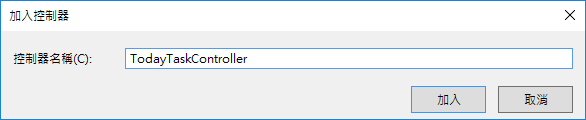
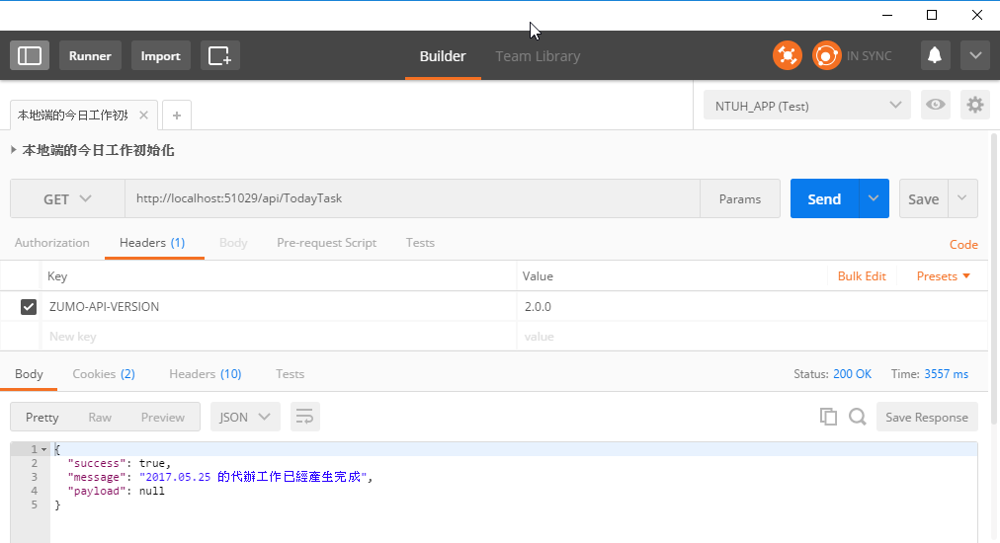
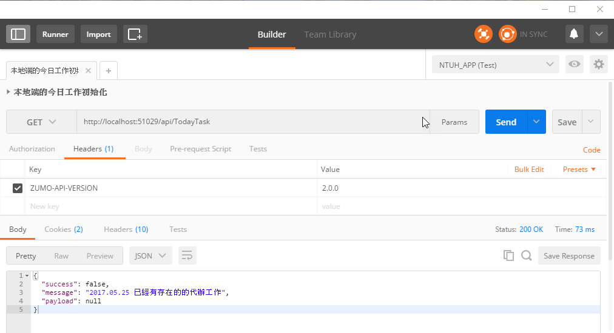
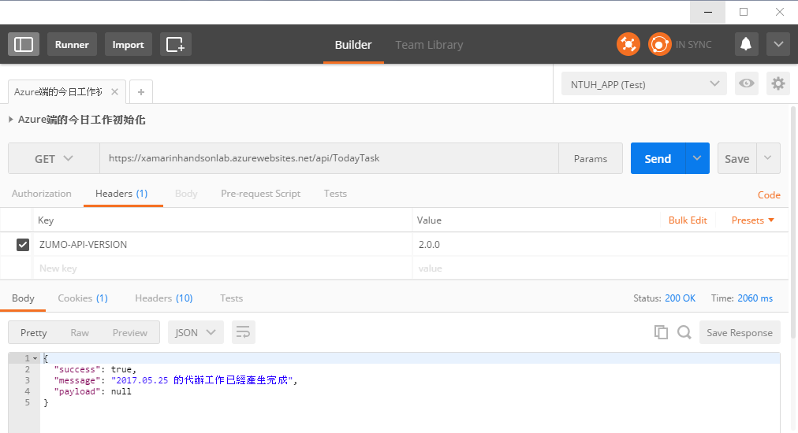
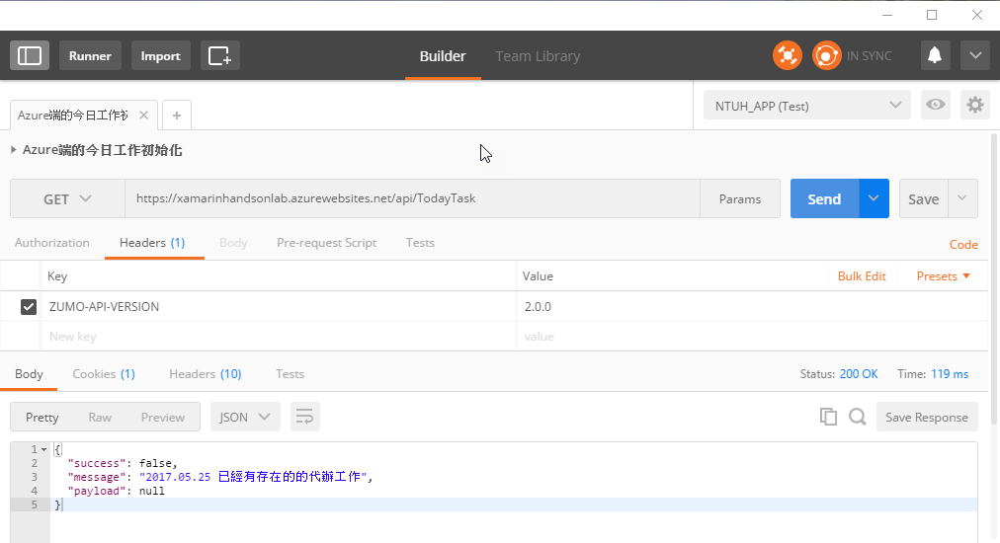
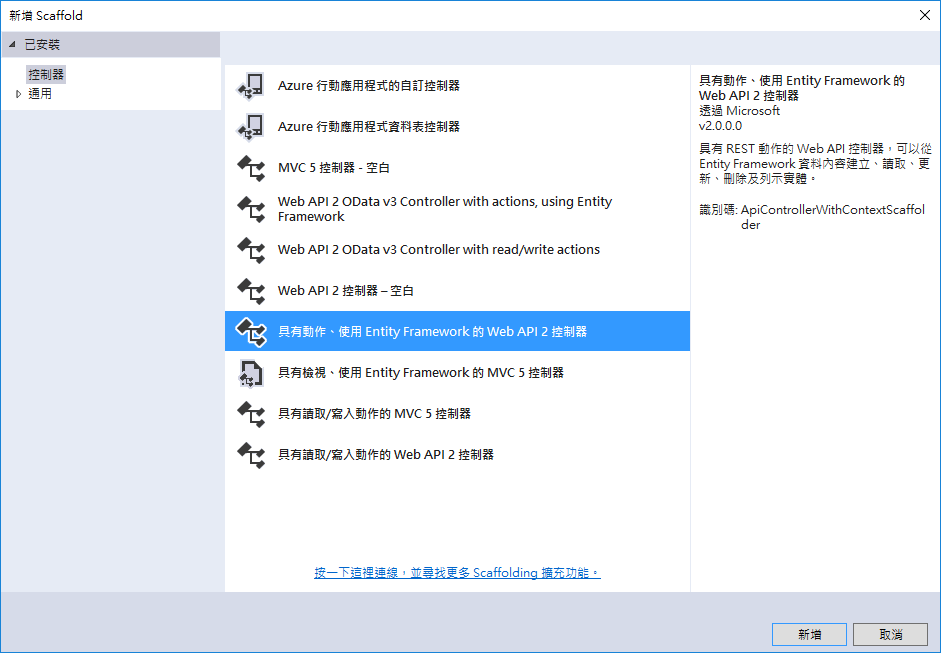
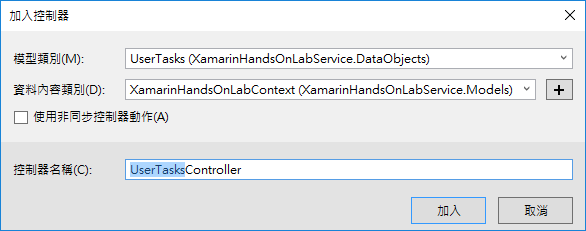
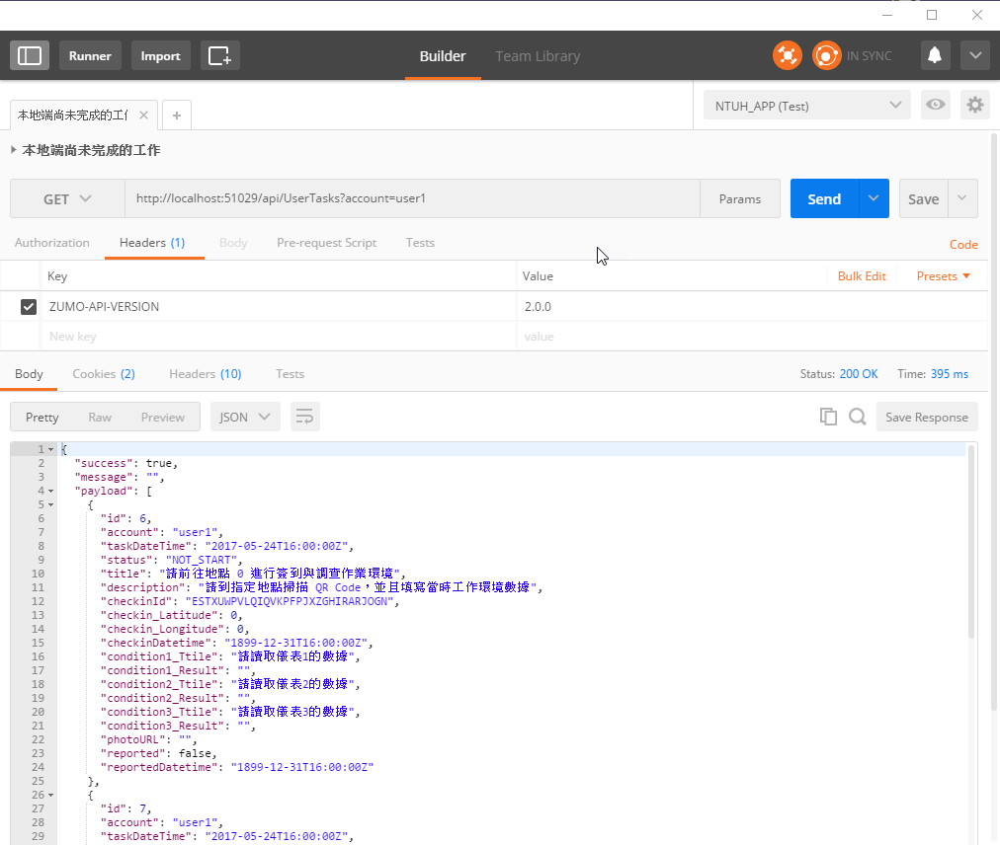
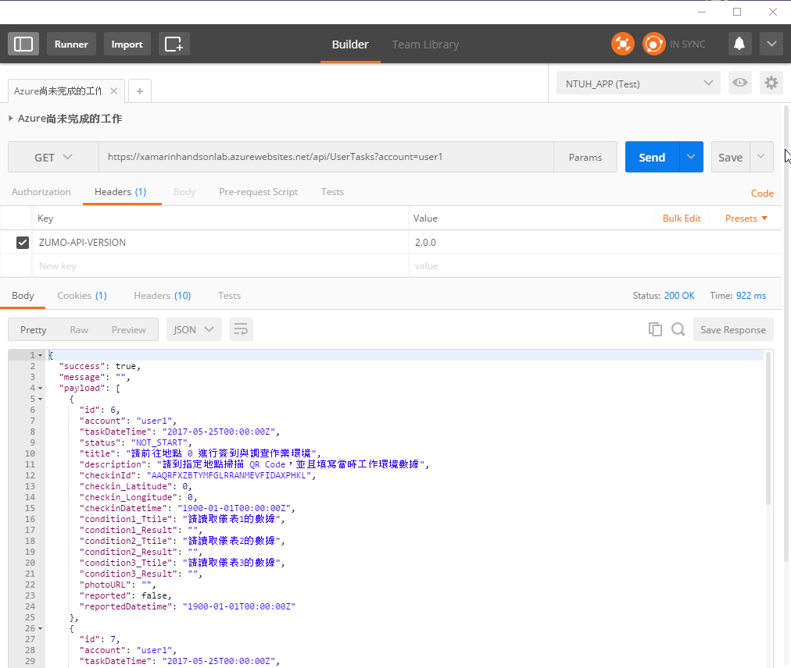

# 建立派工紀錄資之相關服務 Web API

現在，讓我們根據需要開發出第一個派工紀錄用的 API，這個 API 是要提供給管理者使用，當這個 API 被呼叫之後，會自動產生出今天需要處理的工作紀錄項目。這樣，手機端的使用者者就可以透過手機取得最新要處理的工作紀錄，進行相關的處理、回報與更新動作。

> 這是一個模擬派工作業的跨平台行動應用程式開發練習，因此，我們將會模擬一個系統，半自動的幫相關使用者，產生出需要處理的工作紀錄；當然，您可以根據您本身的需求，自行修改程式架構，滿足您的需求。

## 取得今天的工作紀錄

這個 Web API 提供了讓管理者來進行呼叫，並且需要提供管理者的帳號，接著就會到資料庫內進行搜尋；此時，若沒有發現到有任何今天要處理的工作，此時，系統會為每個使用者，都自動產生出五筆今天要處理的工作項目，然而，若發現到今天已經有存在的工作，此時，API就會回報 已經有存在的的代辦工作 訊息。

現在，讓我們來建立一個這樣的 API 服務。

### 建立 產生今天的工作紀錄 API 服務  

* 請滑鼠右擊 `Controllers` 目錄，選擇 `加入` > `控制器`

* 在 `新增 Scaffold` 對話窗內，選擇 `已安裝的` > `控制器` > `Web API 2 控制器 - 空白`

* 點選右下方的 `新增` 按鈕

  

* 當出現 `加入控制器` 對話窗的時候，請輸入 `TodayTask` 於控制器名稱欄位，也就是我們要定義的控制器類別名稱為 `TodayTaskController`

* 接著，請點選 `加入` 按鈕

  

* 在剛剛建立好的 `TodayTaskController.cs` 檔案中，輸入底下程式碼。

```csharp
    /// <summary>
    /// 產生今天的工作紀錄，每個使用者都會有五個新的工作
    /// </summary>
    [MobileAppController]
    public class TodayTaskController : ApiController
    {
        APIResult fooAPIResult = new APIResult();
        private XamarinHandsOnLabContext db = new XamarinHandsOnLabContext();
        private static Random random = new Random((int)DateTime.Now.Ticks);

        public APIResult Get()
        {
            var fooToday = DateTime.Now.Date;
            // 查詢今天產生的工作有那些
            var fooTasks = db.UserTasks.Where(x => DbFunctions.TruncateTime(x.TaskDateTime) == fooToday).ToList();
            if (fooTasks.Count > 0)
            {
                #region 今天的工作已經有產生了
                fooAPIResult.Success = false;
                fooAPIResult.Message = DateTime.Now.ToString("yyyy.MM.dd") + " 已經有存在的的代辦工作";
                fooAPIResult.Payload = null;
                #endregion
            }
            else
            {
                #region 幫每個使用者，產生今天要用到的五個工作
                for (int i = 0; i < 40; i++)
                {
                    var fooAccount = $"user{i}";
                    for (int j = 0; j < 5; j++)
                    {
                        var fooTask = new UserTasks()
                        {
                            Account = fooAccount,
                            Title = $"請前往地點 {j} 進行簽到與調查作業環境",
                            Description = "請到指定地點掃描 QR Code，並且填寫當時工作環境數據",
                            TaskDateTime = DateTime.Now.Date,
                            CheckinId = RandomString(30),
                            Condition1_Ttile = "請讀取儀表1的數據",
                            Condition1_Result = "",
                            Condition2_Ttile = "請讀取儀表2的數據",
                            Condition2_Result = "",
                            Condition3_Ttile = "請讀取儀表3的數據",
                            Condition3_Result = "",
                            Checkin_Latitude = 0,
                            Checkin_Longitude = 0,
                            PhotoURL = "",
                            Reported = false,
                            ReportedDatetime = new DateTime(1900, 1, 1),
                            CheckinDatetime = new DateTime(1900, 1, 1),
                        };

                        db.UserTasks.Add(fooTask);
                    }
                }
                #endregion
                db.SaveChanges();

                fooAPIResult.Success = true;
                fooAPIResult.Message = DateTime.Now.ToString("yyyy.MM.dd") + " 的代辦工作已經產生完成";
                fooAPIResult.Payload = null;
            }
            return fooAPIResult;
        }

        /// <summary>
        /// 產生隨機字串，用於 QR Code 的內容
        /// </summary>
        /// <param name="size"></param>
        /// <returns></returns>
        private string RandomString(int size)
        {
            StringBuilder builder = new StringBuilder();
            char ch;
            for (int i = 0; i < size; i++)
            {
                ch = Convert.ToChar(Convert.ToInt32(Math.Floor(26 * random.NextDouble() + 65)));
                builder.Append(ch);
            }

            return builder.ToString();
        }
    }
```

* 此時，您會看到 Visual Studio 程式碼編輯器中，會出現很多錯誤；此時，請加入底下的 `using` 程式碼：

```csharp
using Microsoft.Azure.Mobile.Server.Config;
using System.Data.Entity;
using XamarinHandsOnLabService.DataObjects;
using XamarinHandsOnLabService.Models;
using System.Text;
```

* 您可以建置這個專案，看看有沒有其他錯誤產生

* 這個 API 僅提供 Get 方法，當呼叫這個 API 的時候，會使用 LINQ `db.UserTasks.Where(x => DbFunctions.TruncateTime(x.TaskDateTime) == fooToday).ToList();` 方法，查詢資料庫內的派工紀錄資料表，今天是否已經有存在的派工紀錄；若今天沒有任何派工紀錄，此時，這個 API 將會幫每個使用者，依據事先規範的規則，自動產生五筆，今天要完成的派工紀錄。

* 由於這個專案可以手機使用者，透過 QR Code 的方式進行打卡，所以，我們在這個 API 內，將會使用方法 `RandomString` 自動產生 30 個隨機文字，作為產生 QR Code 的圖片來源；當使用者掃描 QR Code 之後，將會與這個文字進行比對，若掃描得到的文字與該紀錄的文字相符，那就表示打卡作業完成。

### 測試 產生今天的工作紀錄 API

* 按下 `F5` 開始在本機執行這個專案，看看是否可以正常在本機上執行

* 打開您的 PostMan App 

* 請選擇 `Get` 方法，在網址列填入 `http://localhost:51029/api/TodayTask`

  > 其中， `http://localhost:51029/` 是剛剛開啟的瀏覽器頁面中複製下來的網址。

* 在 Header 頁次中，輸入 Key 為 `ZUMO-API-VERSION` / value 為 `2.0.0`

* 點選最右方的 `Send` 藍色按鈕，就可以看到這次的使用者登入是否成功或者是失敗。

   

* 若您看到底下的 JSON 內容，那就表示您剛剛執行的 API 是正常無誤的。

```json
{
  "success": true,
  "message": "2017.05.25 的代辦工作已經產生完成",
  "payload": null
}
```

* 若我們再度執行一次這個 API

* 點選最右方的 `Send` 藍色按鈕，就可以看到這次的使用者登入是否成功或者是失敗。

   

* 若您看到底下的 JSON 內容，那就表示您剛剛執行的 API 是正常無誤的。不過， success 卻是 false，那叫表示這個 API 告知您進行處理相關工作的時候，產生些問題，接著，根據 message 欄位所得到的錯誤訊息文字，我們知道原因了；因為，這個 API 一天只能夠執行一次，若一天內重複執行多次，則第二次以後的呼救，將不會自動產生派工紀錄了。

```json
{
  "success": false,
  "message": "2017.05.25 已經有存在的的代辦工作",
  "payload": null
}
```

## 發佈到 Azure 上，並且進行測試

### 發佈到 Azure 上

* 按下 `Shift+F5` 停止偵錯

* 滑鼠右擊專案 `XamarinHandsOnLabService`，選擇 `發行`

* 在 `發行` 對話窗，點選 `發行` 按鈕

* 此時，您 Azure 上的後端 API 服務，將會有這個專案來取代

### 測試 產生今天的工作紀錄 API

* 打開您的 PostMan App 

* 請選擇 `Get` 方法，在網址列填入 `https://xamarinhandsonlab.azurewebsites.net/api/TodayTask`

  > 其中， `https://xamarinhandsonlab.azurewebsites.net/` 是剛剛開啟的瀏覽器頁面中複製下來的網址。

* 在 Header 頁次中，輸入 Key 為 `ZUMO-API-VERSION` / value 為 `2.0.0`

* 點選最右方的 `Send` 藍色按鈕，就可以看到這次的使用者登入是否成功或者是失敗。

   

* 若您看到底下的 JSON 內容，那就表示您剛剛執行的 API 是正常無誤的。 

```json
{
  "success": true,
  "message": "2017.05.25 的代辦工作已經產生完成",
  "payload": null
}
```

* 若我們再度執行一次這個 API

* 點選最右方的 `Send` 藍色按鈕，就可以看到這次的使用者登入是否成功或者是失敗。

   

* 若您看到底下的 JSON 內容，那就表示您剛剛執行的 API 是正常無誤的。不過， success 卻是 false，那叫表示這個 API 告知您進行處理相關工作的時候，產生些問題，接著，根據 message 欄位所得到的錯誤訊息文字，我們知道原因了；因為，這個 API 一天只能夠執行一次，若一天內重複執行多次，則第二次以後的呼救，將不會自動產生派工紀錄了。

```json
{
  "success": false,
  "message": "2017.05.25 已經有存在的的代辦工作",
  "payload": null
}
```
## 派工紀錄 CRUD

現在，我們要來寫出一個較為複雜的 Web API，那就是要提供派工紀錄的 新增/讀取/更新/刪除 的 API 服務；由於，我們剛剛已經產生了今天的派工紀錄，所以，我們可以利用這些已經產生的派工紀錄做為測試資料來源依據。

現在，讓我們來建立一個這樣的 API 服務。

### 建立 派工紀錄 CRUD API 服務  

* 請滑鼠右擊 `Controllers` 目錄，選擇 `加入` > `控制器`

* 在 `新增 Scaffold` 對話窗內，選擇 `已安裝的` > `控制器` > `具有動作、使用 Entity Framework 的 Web API 2 控制器`

* 點選右下方的 `新增` 按鈕

  

* 當出現 `加入控制器` 對話窗的時候

* 請在 `模型類別` 下拉選單中，選擇 `UserTasks (XamarinHandsOnLabService.DataObjects)`

* 請在 `資料內容類別` 下拉選單中，選擇 `XamarinHandsOnLabContext (XamarinHandsOnLabService.Models)`

* 請確認在 `控制器名稱` 輸入 `UserTasksController`

* 接著，請點選 `加入` 按鈕 

  

* 在剛剛建立好的 `UserTasksController.cs` 檔案中，將類別 `UserTasksController` 的所有定義程式碼，使用底下程式碼來替換。

```csharp
    /// <summary>
    /// 使用者指派工作的相關 API 服務
    /// </summary>
    [MobileAppController]
    public class UserTasksController : ApiController
    {
        APIResult fooAPIResult = new APIResult();
        private XamarinHandsOnLabContext db = new XamarinHandsOnLabContext();

        /// <summary>
        /// 依據指定的時間，查詢該使用者的所有分配工作
        /// </summary>
        /// <param name="account">使用者帳號</param>
        /// <param name="startDate">開始時間</param>
        /// <param name="lastDate">結束時間</param>
        /// <returns></returns>
        [HttpGet]
        [Route("Filter")]
        public APIResult Get(string account, DateTime startDate, DateTime lastDate)
        {
            // 使用 Entity Framework + LINQ 查詢使用者在指定時間內的所有工作
            var fooTasks = db.UserTasks.Where(x => x.Account == account
                           && DbFunctions.TruncateTime(x.TaskDateTime) >= startDate
                           && DbFunctions.TruncateTime(x.TaskDateTime) <= lastDate).ToList();

            fooAPIResult.Success = true;
            fooAPIResult.Message = "";
            fooAPIResult.Payload = fooTasks;
            return fooAPIResult;
        }

        /// <summary>
        /// 取得該使用者尚未完成的工作清單
        /// </summary>
        /// <param name="account">使用者帳號</param>
        /// <returns></returns>
        [HttpGet]
        // GET: api/UserTasks
        public APIResult Get(string account)
        {
            DateTime fooDt = new DateTime(1900, 1, 1).Date;
            // 使用 Entity Framework + LINQ 查詢使用者尚未完成的所有工作
            var fooTasks = db.UserTasks.Where(x => x.Account == account
                           && DbFunctions.TruncateTime(x.ReportedDatetime) == fooDt).ToList();

            fooAPIResult.Success = true;
            fooAPIResult.Message = "";
            fooAPIResult.Payload = fooTasks;
            return fooAPIResult;
        }

        /// <summary>
        /// 依據使用者工作編號，查詢該工作紀錄
        /// </summary>
        /// <param name="id">工作紀錄編號</param>
        /// <returns></returns>
        [HttpGet]
        [Route("FilterById")]
        public APIResult Get(long id)
        {
            var fooTask = db.UserTasks.FirstOrDefault(x => x.Id == id);
            if (fooTask == null)
            {
                fooAPIResult.Success = false;
                fooAPIResult.Message = "沒有發現指定的工作紀錄";
                fooAPIResult.Payload = null;
            }
            else
            {
                fooAPIResult.Success = true;
                fooAPIResult.Message = "";
                fooAPIResult.Payload = fooTask;
            }
            return fooAPIResult;
        }

        /// <summary>
        /// Post 方法，在這個練習中沒有用到
        /// </summary>
        /// <param name="value"></param>
        public void Post([FromBody]string value)
        {
        }

        /// <summary>
        /// 更新App傳入的工作紀錄內容
        /// </summary>
        /// <param name="userTasks">工作紀錄內容</param>
        /// <returns></returns>
        public APIResult Put([FromBody]UserTasks userTasks)
        {
            string foot = HttpContext.Current.Server.MapPath("~/Uploads");

            int fooNumRec = 0;
            var fooDBObj = db.UserTasks.FirstOrDefault(x => x.Id == userTasks.Id);
            if (fooDBObj != null)
            {
                switch (userTasks.Status)
                {
                    case TaskStatus.NOT_START:
                        #region 工作尚未開始
                        fooAPIResult.Success = false;
                        fooAPIResult.Message = "指定狀態不正確";
                        fooAPIResult.Payload = userTasks;
                        #endregion
                        break;

                    case TaskStatus.CHECKIN:
                        #region 打卡
                        UpdateStatus_CHECKIN(userTasks, fooDBObj);
                        // 通知 Entity Framework，這個紀錄有異動了
                        db.Entry(fooDBObj).State = EntityState.Modified;
                        fooNumRec = db.SaveChanges();
                        if (fooNumRec > 0)
                        {
                            fooAPIResult.Success = true;
                            fooAPIResult.Message = "成功更新資料";
                            fooAPIResult.Payload = fooDBObj;
                        }
                        else
                        {
                            fooAPIResult.Success = false;
                            fooAPIResult.Message = "沒有成功更新任何資料";
                            fooAPIResult.Payload = userTasks;
                        }
                        #endregion
                        break;

                    case TaskStatus.INPUT:
                        #region 工作內容輸入
                        UpdateStatus_CHECKIN(userTasks, fooDBObj);
                        UpdateStatus_INPUT(userTasks, fooDBObj);
                        // 通知 Entity Framework，這個紀錄有異動了
                        db.Entry(fooDBObj).State = EntityState.Modified;
                        fooNumRec = db.SaveChanges();
                        if (fooNumRec > 0)
                        {
                            fooAPIResult.Success = true;
                            fooAPIResult.Message = "成功更新資料";
                            fooAPIResult.Payload = fooDBObj;
                        }
                        else
                        {
                            fooAPIResult.Success = false;
                            fooAPIResult.Message = "沒有成功更新任何資料";
                            fooAPIResult.Payload = userTasks;
                        }
                        #endregion
                        break;

                    case TaskStatus.UPLOAD_IMAGE:
                        #region 圖片上傳
                        UpdateStatus_CHECKIN(userTasks, fooDBObj);
                        UpdateStatus_INPUT(userTasks, fooDBObj);
                        UpdateStatus_UPLOAD_IMAGE(userTasks, fooDBObj);
                        // 通知 Entity Framework，這個紀錄有異動了
                        db.Entry(fooDBObj).State = EntityState.Modified;
                        fooNumRec = db.SaveChanges();
                        if (fooNumRec > 0)
                        {
                            fooAPIResult.Success = true;
                            fooAPIResult.Message = "成功更新資料";
                            fooAPIResult.Payload = fooDBObj;
                        }
                        else
                        {
                            fooAPIResult.Success = false;
                            fooAPIResult.Message = "沒有成功更新任何資料";
                            fooAPIResult.Payload = userTasks;
                        }
                        #endregion
                        break;

                    case TaskStatus.REPORTED:
                        #region 完工與回報
                        UpdateStatus_CHECKIN(userTasks, fooDBObj);
                        UpdateStatus_INPUT(userTasks, fooDBObj);
                        UpdateStatus_UPLOAD_IMAGE(userTasks, fooDBObj);
                        UpdateStatus_REPORTED(userTasks, fooDBObj);
                        // 通知 Entity Framework，這個紀錄有異動了
                        db.Entry(fooDBObj).State = EntityState.Modified;
                        fooNumRec = db.SaveChanges();
                        if (fooNumRec > 0)
                        {
                            fooAPIResult.Success = true;
                            fooAPIResult.Message = "成功更新資料";
                            fooAPIResult.Payload = fooDBObj;
                        }
                        else
                        {
                            fooAPIResult.Success = false;
                            fooAPIResult.Message = "沒有成功更新任何資料";
                            fooAPIResult.Payload = userTasks;
                        }
                        #endregion
                        break;

                    default:
                        fooAPIResult.Success = false;
                        fooAPIResult.Message = $"沒有符合的工作狀態馬 = {userTasks.Status}";
                        fooAPIResult.Payload = userTasks;
                        break;
                }
            }
            else
            {
                fooAPIResult.Success = false;
                fooAPIResult.Message = $"沒有發現工作紀錄 ID = {userTasks.Id}";
                fooAPIResult.Payload = userTasks;
            }
            return fooAPIResult;
        }

        // DELETE 方法，在這個練習中沒有用到
        public void Delete(int id)
        {
        }

        /// <summary>
        /// 使用者已經打卡了，將狀態更新到打卡狀態
        /// </summary>
        /// <param name="source"></param>
        /// <param name="targetDB"></param>
        void UpdateStatus_CHECKIN(UserTasks source, UserTasks targetDB)
        {
            targetDB.Status = TaskStatus.CHECKIN;
            targetDB.CheckinDatetime = DateTime.UtcNow.AddHours(8);
            targetDB.Checkin_Latitude = source.Checkin_Latitude;
            targetDB.Checkin_Longitude = source.Checkin_Longitude;
        }

        /// <summary>
        /// 使用者已經填寫工作內容了，將狀態更新到資料已經輸入狀態
        /// </summary>
        /// <param name="userTasks">App傳入的工作紀錄</param>
        /// <param name="targetDB">要更新到資料庫內的工作紀錄</param>
        private void UpdateStatus_INPUT(UserTasks userTasks, UserTasks targetDB)
        {
            targetDB.Status = TaskStatus.INPUT;
            targetDB.Condition1_Result = userTasks.Condition1_Result;
            targetDB.Condition2_Result = userTasks.Condition2_Result;
            targetDB.Condition3_Result = userTasks.Condition3_Result;
        }

        /// <summary>
        /// 使用者已經上傳圖片了，將狀態更新到上傳圖片狀態
        /// </summary>
        /// <param name="userTasks">App傳入的工作紀錄</param>
        /// <param name="fooDBObj">要更新到資料庫內的工作紀錄</param>
        private void UpdateStatus_UPLOAD_IMAGE(UserTasks userTasks, UserTasks targetDB)
        {
            string fooPath1 = "";
            string fooPath2 = "";
            targetDB.Status = TaskStatus.UPLOAD_IMAGE;
            if (userTasks.PhotoURL.IndexOf("http://") >= 0 || userTasks.PhotoURL.IndexOf("https://") >= 0)
            {
                // 因為該欄位是個網址，所以，圖片已經上船且處理好了
            }
            else
            {
                #region 將上傳後的圖片，從暫存區 Uploads 搬移到 Images 目錄下
                fooPath1 = Path.Combine(HttpContext.Current.Server.MapPath("~/Uploads"), userTasks.PhotoURL);
                fooPath2 = Path.Combine(HttpContext.Current.Server.MapPath("~/Images"), userTasks.PhotoURL);
                File.Move(fooPath1, fooPath2);
                #endregion
                // 將上傳圖片檔名，更換成為一個 URL
                targetDB.PhotoURL = $"http://xamarinhandsonlab.azurewebsites.net/Images/{userTasks.PhotoURL}";
            }
        }

        /// <summary>
        /// 使用者已經回報工作了，將狀態更新到回報工作狀態
        /// </summary>
        /// <param name="userTasks">App傳入的工作紀錄</param>
        /// <param name="fooDBObj">要更新到資料庫內的工作紀錄</param>
        private void UpdateStatus_REPORTED(UserTasks userTasks, UserTasks targetDB)
        {
            targetDB.Status = TaskStatus.REPORTED;
            targetDB.ReportedDatetime = DateTime.UtcNow.AddHours(8);
        }

    }
```

* 此時，您會看到 Visual Studio 程式碼編輯器中，會出現很多錯誤；此時，請加入底下的 `using` 程式碼：

```csharp
using Microsoft.Azure.Mobile.Server.Config;
using System.IO;
using System.Web;
```

* 您可以建置這個專案，看看有沒有其他錯誤產生

* 接下來，讓我們來看看這個 CRUD 程式碼做了喇些事情

### 派工紀錄 新增 Post

在這個練習中，關於派工紀錄的 Web API 中，並沒有提供可以透過 Web API 呼叫方式來產生出一筆新的派工紀錄需求，而是由管理者透過 `取得今天的工作紀錄` 的 Web API 來產生出來的，因此，在這裡，我們就不去實作出產生派工紀錄的程式碼；若您有方面的需要，可以參考底下程式碼，便可以很容易地做出新增派工紀錄的服務功能。

### 派工紀錄 讀取 Get

在讀取派工紀錄的需求中，將會有底下的功能要實做出來 `依據指定的時間，查詢該使用者的所有分配工作` / `取得該使用者尚未完成的工作清單` / `依據使用者工作編號，查詢該工作紀錄` 。

在底下，我們將分別說明這些功能是如何實做出來的。

### 派工紀錄 讀取 Get 依據指定的時間，查詢該使用者的所有分配工作

* 這是一個 Get 動作的 API，因此，使用 `[HttpGet]` 屬性標示出來

* 這並不是預設的 Get 動作，因此，我們使用了 `[Route("Filter")]`屬性，標示這個 API 的呼叫路徑

* 呼叫這個 API ，將需要傳入兩個日期，一個是開始日期，一個是結束日期

* 我們需要到派工紀錄資料庫內，搜尋這兩個日期區間的所有派工紀錄出來，在這裡，我們使用了 LINQ 技術，查詢出這段期間的所有派工紀錄資料出來。

* 最後，將取得的派工紀錄資料，透過 `Payload` 欄位，回傳到使用者端。

```csharp
// 使用 Entity Framework + LINQ 查詢使用者在指定時間內的所有工作
            var fooTasks = db.UserTasks.Where(x => x.Account == account
                           && DbFunctions.TruncateTime(x.TaskDateTime) >= startDate
                           && DbFunctions.TruncateTime(x.TaskDateTime) <= lastDate).ToList();
```                        

### 派工紀錄 讀取 Get 取得該使用者尚未完成的工作清單

* 這是一個 Get 動作的 API，因此，使用 `[HttpGet]` 屬性標示出來

* 這個 API 動作將會依據傳送的指定使用者帳號，使用底下 LINQ 敘述，查詢尚未完成的派工紀錄(若這個工作為未完工，則 `ReportedDatetime` 欄位的日期將會是 `1900/01/01`)

  `db.UserTasks.Where(x => x.Account == account && DbFunctions.TruncateTime(x.ReportedDatetime) == fooDt).ToList();`

* 最後，將取得的派工紀錄資料，透過 `Payload` 欄位，回傳到使用者端。

### 派工紀錄 讀取 Get 依據使用者工作編號，查詢該工作紀錄

* 這是一個 Get 動作的 API，因此，使用 `[HttpGet]` 屬性標示出來

* 這並不是預設的 Get 動作，因此，我們使用了 `[Route("FilterById")]`屬性，標示這個 API 的呼叫路徑

* 呼叫這個 API ，將需要傳入工作紀錄編號

* 我們需要到派工紀錄資料庫內，使用了 LINQ 技術，查詢出符合條件派工紀錄資料出來。

  `var fooTask = db.UserTasks.FirstOrDefault(x => x.Id == id);`

* 最後，將取得的派工紀錄資料，透過 `Payload` 欄位，回傳到使用者端。

### 派工紀錄 更新 Put

* 在這裡，手機端的程式，將會把要修改的派工紀錄資料，以 JSON 格式傳送到這個 Put 動作 API 。

* 在 Put API，我們使用 `[FromBode]` 指定要接收的派工紀錄資料，不是使用 Query String 的方式傳送過來。`public APIResult Put([FromBody]UserTasks userTasks)`

* 首先我們需要檢查這筆紀錄是否有存在資料庫內，我們使用這個方法 `var fooDBObj = db.UserTasks.FirstOrDefault(x => x.Id == userTasks.Id);` 進行查詢。

* 接著，根據資料庫內的紀錄狀態值，決定將該派工紀錄狀態切換到下一個狀態中，這裡，我們使用了 `switch (userTasks.Status)` 的方式來進行比對與處理。

  > 我們之前有定義派工紀錄的狀態為一個列舉型別，所以，在這裡的程式碼，我們可以很清楚的知道要處理的相關動作內容。

* 一旦我們有修改了任何派工紀錄的欄位，我們需要執行敘述 `db.Entry(fooDBObj).State = EntityState.Modified; fooNumRec = db.SaveChanges();`，這樣，此次的資料異動，才會更新到 SQL Server 資料庫內。

### 派工紀錄 刪除 Delete

* 在這個實作中，對於派工紀錄，使用者是無法進行刪除的，因此，我們也沒有實作 `Delete` 動作。

### 派工紀錄 支援方法

* 對於圖片上傳的部分，當使用者第一次上傳圖片的時候，該圖片會存放於 `Uploads` 目錄下，若使用者有更新這筆派工紀錄，此時，系統將會把已經上傳的圖片搬移到 `Images` 目錄下，並且更新 `PhotoURL` 這個欄位；這樣，在手機端的應用程式，才能夠正常的顯示出已經上傳的圖片內容。

  這樣的設計，是為了避免使用者已經上傳了圖片，但是，沒有將派工紀錄存檔，將會造成後端伺服器充滿了許多不存在關聯的圖片檔案，因此，只要是存在於 `Uploads` 目錄下的檔案，都可以視為暫時性儲存的檔案，後台管理者可以撰寫一個批次程序程式，定時來清除這個目錄下已經逾期的檔案。

## 測試 派工紀錄 API

* 按下 `F5` 開始在本機執行這個專案，看看是否可以正常在本機上執行

* 打開您的 PostMan App 

* 請選擇 `Get` 方法，在網址列填入 `http://localhost:51029/api/UserTasks?account=user1`

  > 其中， `http://localhost:51029/` 是剛剛開啟的瀏覽器頁面中複製下來的網址。

* 在 Header 頁次中，輸入 Key 為 `ZUMO-API-VERSION` / value 為 `2.0.0`

* 點選最右方的 `Send` 藍色按鈕，就可以看到這次的使用者登入是否成功或者是失敗。

   

* 若您看到底下的 JSON 內容，那就表示您剛剛執行的 API 是正常無誤的。而且，此次查詢派工紀錄是否有成功，可以觀察 success 欄位的值；該使用者的詳細資訊，將會存在於 payload 欄位內。

```json
{
  "success": true,
  "message": "",
  "payload": [
    {
      "id": 6,
      "account": "user1",
      "taskDateTime": "2017-05-24T16:00:00Z",
      "status": "NOT_START",
      "title": "請前往地點 0 進行簽到與調查作業環境",
      "description": "請到指定地點掃描 QR Code，並且填寫當時工作環境數據",
      "checkinId": "ESTXUWPVLQIQVKPFPJXZGHIRARJOGN",
      "checkin_Latitude": 0,
      "checkin_Longitude": 0,
      "checkinDatetime": "1899-12-31T16:00:00Z",
      "condition1_Ttile": "請讀取儀表1的數據",
      "condition1_Result": "",
      "condition2_Ttile": "請讀取儀表2的數據",
      "condition2_Result": "",
      "condition3_Ttile": "請讀取儀表3的數據",
      "condition3_Result": "",
      "photoURL": "",
      "reported": false,
      "reportedDatetime": "1899-12-31T16:00:00Z"
    },
    {
      "id": 7,
      "account": "user1",
      "taskDateTime": "2017-05-24T16:00:00Z",
      "status": "NOT_START",
      "title": "請前往地點 1 進行簽到與調查作業環境",
      "description": "請到指定地點掃描 QR Code，並且填寫當時工作環境數據",
      "checkinId": "XVHXRGXDGTSHRQXDRMSMGPPQQXKBXD",
      "checkin_Latitude": 0,
      "checkin_Longitude": 0,
      "checkinDatetime": "1899-12-31T16:00:00Z",
      "condition1_Ttile": "請讀取儀表1的數據",
      "condition1_Result": "",
      "condition2_Ttile": "請讀取儀表2的數據",
      "condition2_Result": "",
      "condition3_Ttile": "請讀取儀表3的數據",
      "condition3_Result": "",
      "photoURL": "",
      "reported": false,
      "reportedDatetime": "1899-12-31T16:00:00Z"
    },
    {
      "id": 8,
      "account": "user1",
      "taskDateTime": "2017-05-24T16:00:00Z",
      "status": "NOT_START",
      "title": "請前往地點 2 進行簽到與調查作業環境",
      "description": "請到指定地點掃描 QR Code，並且填寫當時工作環境數據",
      "checkinId": "NAPYSMIXTJIMCEGZQRTWZWVTHIGQGU",
      "checkin_Latitude": 0,
      "checkin_Longitude": 0,
      "checkinDatetime": "1899-12-31T16:00:00Z",
      "condition1_Ttile": "請讀取儀表1的數據",
      "condition1_Result": "",
      "condition2_Ttile": "請讀取儀表2的數據",
      "condition2_Result": "",
      "condition3_Ttile": "請讀取儀表3的數據",
      "condition3_Result": "",
      "photoURL": "",
      "reported": false,
      "reportedDatetime": "1899-12-31T16:00:00Z"
    },
    {
      "id": 9,
      "account": "user1",
      "taskDateTime": "2017-05-24T16:00:00Z",
      "status": "NOT_START",
      "title": "請前往地點 3 進行簽到與調查作業環境",
      "description": "請到指定地點掃描 QR Code，並且填寫當時工作環境數據",
      "checkinId": "VVGDGRRSXLUUTJDUMKKRGSHADQEWRK",
      "checkin_Latitude": 0,
      "checkin_Longitude": 0,
      "checkinDatetime": "1899-12-31T16:00:00Z",
      "condition1_Ttile": "請讀取儀表1的數據",
      "condition1_Result": "",
      "condition2_Ttile": "請讀取儀表2的數據",
      "condition2_Result": "",
      "condition3_Ttile": "請讀取儀表3的數據",
      "condition3_Result": "",
      "photoURL": "",
      "reported": false,
      "reportedDatetime": "1899-12-31T16:00:00Z"
    },
    {
      "id": 10,
      "account": "user1",
      "taskDateTime": "2017-05-24T16:00:00Z",
      "status": "NOT_START",
      "title": "請前往地點 4 進行簽到與調查作業環境",
      "description": "請到指定地點掃描 QR Code，並且填寫當時工作環境數據",
      "checkinId": "FSQYNMGZYOHXTIBFDMQMWWGPODOFAP",
      "checkin_Latitude": 0,
      "checkin_Longitude": 0,
      "checkinDatetime": "1899-12-31T16:00:00Z",
      "condition1_Ttile": "請讀取儀表1的數據",
      "condition1_Result": "",
      "condition2_Ttile": "請讀取儀表2的數據",
      "condition2_Result": "",
      "condition3_Ttile": "請讀取儀表3的數據",
      "condition3_Result": "",
      "photoURL": "",
      "reported": false,
      "reportedDatetime": "1899-12-31T16:00:00Z"
    }
  ]
}
```

## 發佈到 Azure 上，並且進行測試

### 發佈到 Azure 上

* 按下 `Shift+F5` 停止偵錯

* 滑鼠右擊專案 `XamarinHandsOnLabService`，選擇 `發行`

* 在 `發行` 對話窗，點選 `發行` 按鈕

* 此時，您 Azure 上的後端 API 服務，將會有這個專案來取代

### 測試 派工紀錄 API

* 請選擇 `Get` 方法，在網址列填入 `https://xamarinhandsonlab.azurewebsites.net/api/UserTasks?account=user1`

  > 其中， `https://xamarinhandsonlab.azurewebsites.net/` 是剛剛開啟的瀏覽器頁面中複製下來的網址。

* 在 Header 頁次中，輸入 Key 為 `ZUMO-API-VERSION` / value 為 `2.0.0`

* 點選最右方的 `Send` 藍色按鈕，就可以看到這次的使用者登入是否成功或者是失敗。

    

* 若您看到底下的 JSON 內容，那就表示您剛剛執行的 API 是正常無誤的。而且，此次查詢派工紀錄是否有成功，可以觀察 success 欄位的值；該使用者的詳細資訊，將會存在於 payload 欄位內。

```json
{
  "success": true,
  "message": "",
  "payload": [
    {
      "id": 6,
      "account": "user1",
      "taskDateTime": "2017-05-25T00:00:00Z",
      "status": "NOT_START",
      "title": "請前往地點 0 進行簽到與調查作業環境",
      "description": "請到指定地點掃描 QR Code，並且填寫當時工作環境數據",
      "checkinId": "AAQRFXZBTYMFGLRRANMEVFIDAXPHKL",
      "checkin_Latitude": 0,
      "checkin_Longitude": 0,
      "checkinDatetime": "1900-01-01T00:00:00Z",
      "condition1_Ttile": "請讀取儀表1的數據",
      "condition1_Result": "",
      "condition2_Ttile": "請讀取儀表2的數據",
      "condition2_Result": "",
      "condition3_Ttile": "請讀取儀表3的數據",
      "condition3_Result": "",
      "photoURL": "",
      "reported": false,
      "reportedDatetime": "1900-01-01T00:00:00Z"
    },
    {
      "id": 7,
      "account": "user1",
      "taskDateTime": "2017-05-25T00:00:00Z",
      "status": "NOT_START",
      "title": "請前往地點 1 進行簽到與調查作業環境",
      "description": "請到指定地點掃描 QR Code，並且填寫當時工作環境數據",
      "checkinId": "CCNZTSOXTISICOCOMVGEDDHTHVRNQH",
      "checkin_Latitude": 0,
      "checkin_Longitude": 0,
      "checkinDatetime": "1900-01-01T00:00:00Z",
      "condition1_Ttile": "請讀取儀表1的數據",
      "condition1_Result": "",
      "condition2_Ttile": "請讀取儀表2的數據",
      "condition2_Result": "",
      "condition3_Ttile": "請讀取儀表3的數據",
      "condition3_Result": "",
      "photoURL": "",
      "reported": false,
      "reportedDatetime": "1900-01-01T00:00:00Z"
    },
    {
      "id": 8,
      "account": "user1",
      "taskDateTime": "2017-05-25T00:00:00Z",
      "status": "NOT_START",
      "title": "請前往地點 2 進行簽到與調查作業環境",
      "description": "請到指定地點掃描 QR Code，並且填寫當時工作環境數據",
      "checkinId": "HRRIWKSHSZDCUDMMDTBLKUBGHYUTRY",
      "checkin_Latitude": 0,
      "checkin_Longitude": 0,
      "checkinDatetime": "1900-01-01T00:00:00Z",
      "condition1_Ttile": "請讀取儀表1的數據",
      "condition1_Result": "",
      "condition2_Ttile": "請讀取儀表2的數據",
      "condition2_Result": "",
      "condition3_Ttile": "請讀取儀表3的數據",
      "condition3_Result": "",
      "photoURL": "",
      "reported": false,
      "reportedDatetime": "1900-01-01T00:00:00Z"
    },
    {
      "id": 9,
      "account": "user1",
      "taskDateTime": "2017-05-25T00:00:00Z",
      "status": "NOT_START",
      "title": "請前往地點 3 進行簽到與調查作業環境",
      "description": "請到指定地點掃描 QR Code，並且填寫當時工作環境數據",
      "checkinId": "BBHLBARTSRWFCHBBIDHVRXLEWNPKBX",
      "checkin_Latitude": 0,
      "checkin_Longitude": 0,
      "checkinDatetime": "1900-01-01T00:00:00Z",
      "condition1_Ttile": "請讀取儀表1的數據",
      "condition1_Result": "",
      "condition2_Ttile": "請讀取儀表2的數據",
      "condition2_Result": "",
      "condition3_Ttile": "請讀取儀表3的數據",
      "condition3_Result": "",
      "photoURL": "",
      "reported": false,
      "reportedDatetime": "1900-01-01T00:00:00Z"
    },
    {
      "id": 10,
      "account": "user1",
      "taskDateTime": "2017-05-25T00:00:00Z",
      "status": "NOT_START",
      "title": "請前往地點 4 進行簽到與調查作業環境",
      "description": "請到指定地點掃描 QR Code，並且填寫當時工作環境數據",
      "checkinId": "PZPTXBVICLVJBJPFRTFGQQLWHEQCPN",
      "checkin_Latitude": 0,
      "checkin_Longitude": 0,
      "checkinDatetime": "1900-01-01T00:00:00Z",
      "condition1_Ttile": "請讀取儀表1的數據",
      "condition1_Result": "",
      "condition2_Ttile": "請讀取儀表2的數據",
      "condition2_Result": "",
      "condition3_Ttile": "請讀取儀表3的數據",
      "condition3_Result": "",
      "photoURL": "",
      "reported": false,
      "reportedDatetime": "1900-01-01T00:00:00Z"
    }
  ]
}
```

