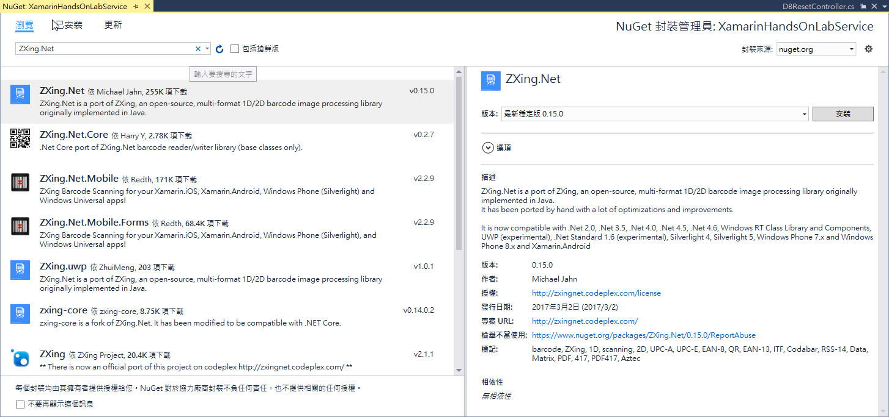
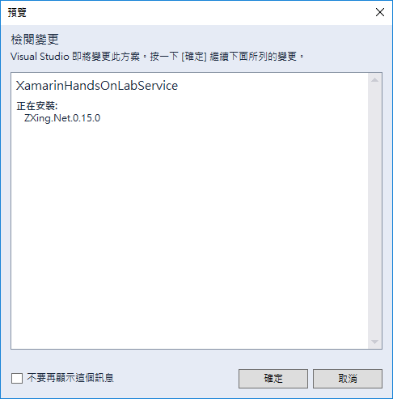
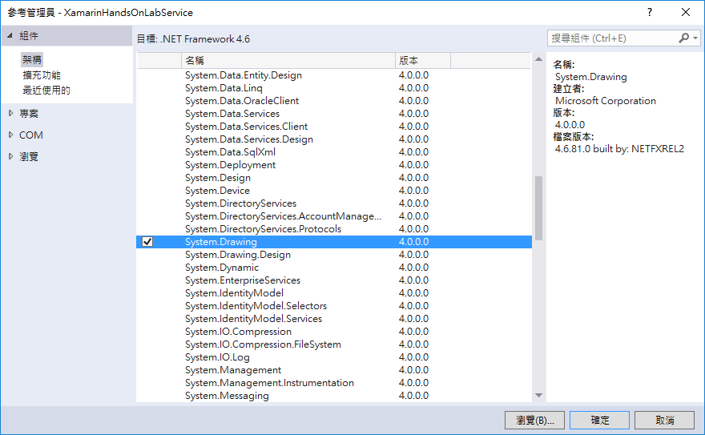
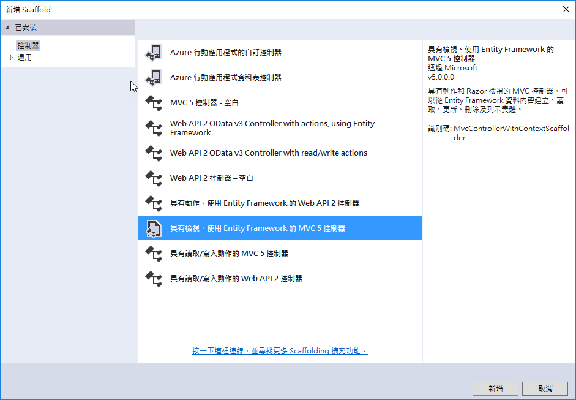
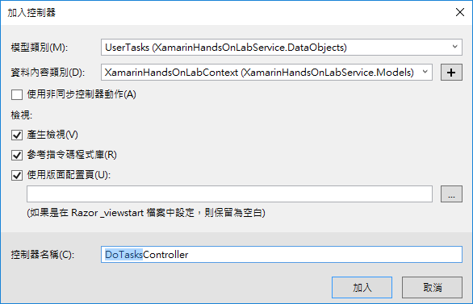
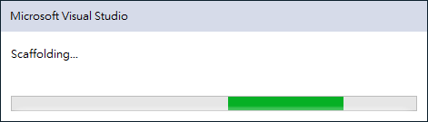
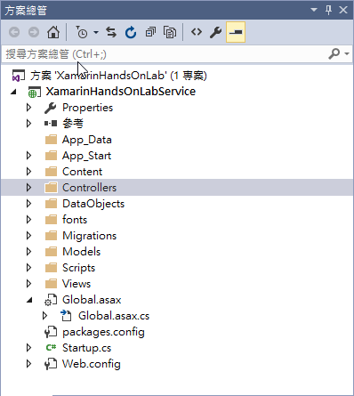
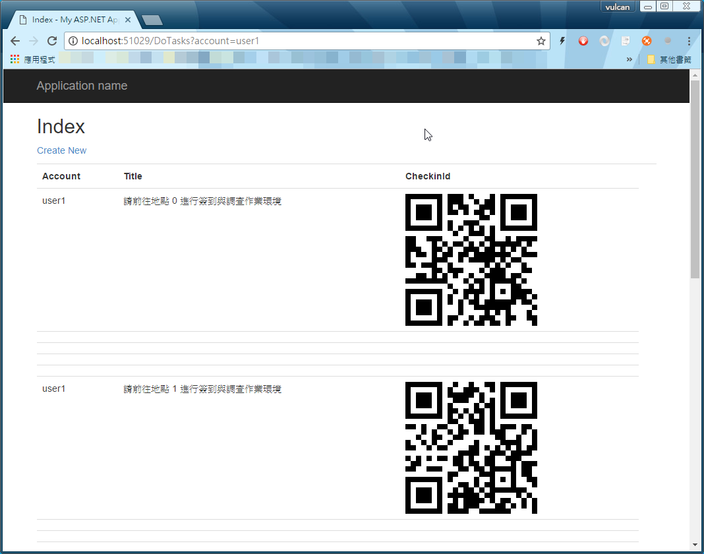
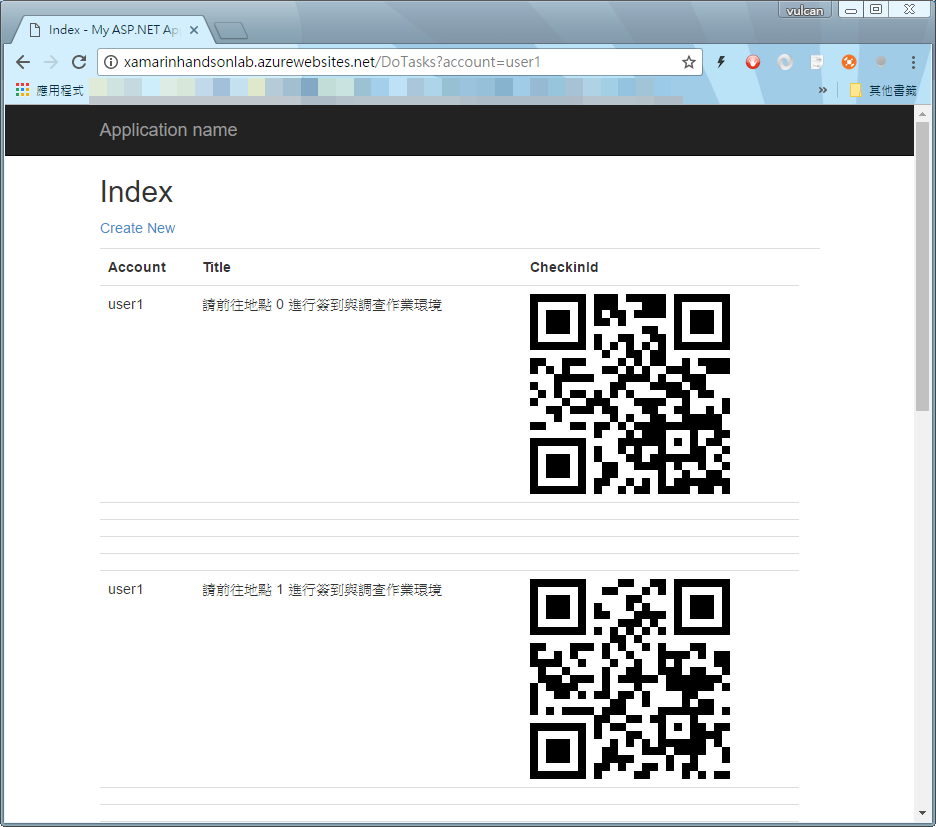

# 虛擬 QR Code 打卡測試網頁

現在，讓我們來製作一個網頁，這個 `虛擬打卡模擬網頁`，在這個網頁中，我們傳入使用者帳號，接著，就會顯示出該使用者需要完成的工作項目清單；在這個清單內，每個工作項目旁邊，都有一個 QR Code 圖片，使用者可以使用手機上的 App，掃描這些指定工作的 QR Code 圖片，以完成 QR Code 打卡動作。

現在，讓我們來建立一個這樣的網頁。

## 安裝顯示 QR Code 圖片的套件

* 為了要能夠在網頁上顯示出 QR Code 的圖片，我們還需要安裝 `ZXing.Net` 套件

* 滑鼠右擊 `XamarinHandsOnLabService` 專案名稱，選擇 `管理 NuGet 套件`

* 當 `管理 NuGet 套件` 視窗出現之後，點選 `瀏覽`

* 在搜尋文字輸入盒中，輸入 `ZXing.Net`

* 點選 `安裝` 按鈕，安裝這個套件

  

  

## 加入 QR Code 圖片會用到的參考

* 滑鼠右擊 `XamarinHandsOnLabService` 內的 `參考` 節點，選擇 `加入參考`

* 點選左方的 `組件` > `架構`

* 找到 `System.Drawing` 項目，勾選它

* 點選 `確定` 按鈕

  

## 建立  虛擬 QR Code 打卡測試網頁

* 請滑鼠右擊 `Controllers` 目錄，選擇 `加入` > `控制器`

* 在 `新增 Scaffold` 對話窗內，選擇 `已安裝的` > `控制器` > `具有檢視、使用 Entity Framework 的 MVC 5 控制器`

* 點選右下方的 `新增` 按鈕

  

* 當出現 `加入控制器` 對話窗的時候

* 在 `模型類別` 下拉選單中，選擇 `UserTasks (XamarinHandsOnLabService.DataObjects)`

* 在 `控制器名稱` 中，請輸入 `DoTasks` ，也就是我們要定義的控制器類別名稱為 `DoTasksController` 

* 其他選項，請參考下圖，維持預設值

* 接著，請點選 `加入` 按鈕

  

* 此時，螢幕會顯示如下圖的一個對話窗，稍微等候一下，這個 `DoTasksController` 控制器就會產生完成了。

  

* 當完成這個 MVC 5 控制器建立之後，您的 Visual Studio 方案，就會產生出許多其他檔案與目錄，這些都是在建立 MVC5 控制器需求時候，所產生與用到的。

  

* 打開 `Controllers` 目錄下的 `DoTasksController.cs` 檔案，將底下程式碼替換到 `DoTasksController` 類別。

```csharp
    /// <summary>
    /// 顯示網頁，展示出該使用者要打卡的 QR Code 圖片
    /// </summary>
    [MobileAppController]
    public class DoTasksController : Controller
    {
        private XamarinHandsOnLabContext db = new XamarinHandsOnLabContext();

        // GET: DoTasks
        public async Task<ActionResult> Index(string account)
        {
            // 查詢該使用的未完成工作有哪些
            var fooToday =new DateTime(1900,1,1).Date;
            return View(await db.UserTasks.Where(x=>DbFunctions.TruncateTime(x.ReportedDatetime) == fooToday
                                  && x.Account == account).ToListAsync());
        }

        // GET: DoTasks/Details/5
        public async Task<ActionResult> Details(long? id)
        {
            if (id == null)
            {
                return new HttpStatusCodeResult(HttpStatusCode.BadRequest);
            }
            UserTasks userTasks = await db.UserTasks.FindAsync(id);
            if (userTasks == null)
            {
                return HttpNotFound();
            }
            return View(userTasks);
        }

        // GET: DoTasks/Create
        public ActionResult Create()
        {
            return View();
        }

        // POST: DoTasks/Create
        // 若要免於過量張貼攻擊，請啟用想要繫結的特定屬性，如需
        // 詳細資訊，請參閱 http://go.microsoft.com/fwlink/?LinkId=317598。
        [HttpPost]
        [ValidateAntiForgeryToken]
        public async Task<ActionResult> Create([Bind(Include = "Id,Account,TaskDateTime,Status,Title,Description,CheckinId,Checkin_Latitude,Checkin_Longitude,CheckinDatetime,Condition1_Ttile,Condition1_Result,Condition2_Ttile,Condition2_Result,Condition3_Ttile,Condition3_Result,PhotoURL,Reported,ReportedDatetime")] UserTasks userTasks)
        {
            if (ModelState.IsValid)
            {
                db.UserTasks.Add(userTasks);
                await db.SaveChangesAsync();
                return RedirectToAction("Index");
            }

            return View(userTasks);
        }

        // GET: DoTasks/Edit/5
        public async Task<ActionResult> Edit(long? id)
        {
            if (id == null)
            {
                return new HttpStatusCodeResult(HttpStatusCode.BadRequest);
            }
            UserTasks userTasks = await db.UserTasks.FindAsync(id);
            if (userTasks == null)
            {
                return HttpNotFound();
            }
            return View(userTasks);
        }

        // POST: DoTasks/Edit/5
        // 若要免於過量張貼攻擊，請啟用想要繫結的特定屬性，如需
        // 詳細資訊，請參閱 http://go.microsoft.com/fwlink/?LinkId=317598。
        [HttpPost]
        [ValidateAntiForgeryToken]
        public async Task<ActionResult> Edit([Bind(Include = "Id,Account,TaskDateTime,Status,Title,Description,CheckinId,Checkin_Latitude,Checkin_Longitude,CheckinDatetime,Condition1_Ttile,Condition1_Result,Condition2_Ttile,Condition2_Result,Condition3_Ttile,Condition3_Result,PhotoURL,Reported,ReportedDatetime")] UserTasks userTasks)
        {
            if (ModelState.IsValid)
            {
                db.Entry(userTasks).State = EntityState.Modified;
                await db.SaveChangesAsync();
                return RedirectToAction("Index");
            }
            return View(userTasks);
        }

        // GET: DoTasks/Delete/5
        public async Task<ActionResult> Delete(long? id)
        {
            if (id == null)
            {
                return new HttpStatusCodeResult(HttpStatusCode.BadRequest);
            }
            UserTasks userTasks = await db.UserTasks.FindAsync(id);
            if (userTasks == null)
            {
                return HttpNotFound();
            }
            return View(userTasks);
        }

        // POST: DoTasks/Delete/5
        [HttpPost, ActionName("Delete")]
        [ValidateAntiForgeryToken]
        public async Task<ActionResult> DeleteConfirmed(long id)
        {
            UserTasks userTasks = await db.UserTasks.FindAsync(id);
            db.UserTasks.Remove(userTasks);
            await db.SaveChangesAsync();
            return RedirectToAction("Index");
        }

        protected override void Dispose(bool disposing)
        {
            if (disposing)
            {
                db.Dispose();
            }
            base.Dispose(disposing);
        }
    }
```

* 此時，您會看到 Visual Studio 程式碼編輯器中，會出現很多錯誤；此時，請加入底下的 `using` 程式碼：

```csharp
using Microsoft.Azure.Mobile.Server.Config;
using System.Threading.Tasks;
```

* 滑鼠右擊專案 `XamarinHandsOnLabService`

* 選擇 `加入` > `新增資料夾`

* 在剛剛產生的新資料夾中，輸入名字 `Helpers`

* 滑鼠右擊 `Helpers` 資料夾，選擇 `加入` > `類別`

* 在 `加入新項目` 對話窗中，點選 `已安裝的` > `Visual C#` > `類別`

* 在 `加入新項目` 對話窗的名稱欄位，輸入 `QRHelper`

* 點選 `新增` 按鈕，開始產生這個類別

* 在這個 `QRHelper.cs` 檔案中，把 `QRHelper` 類別，使用底下程式碼替換掉。

```csharp
    public static class QRHelper
    {
        /// <summary>
        /// 產生一個 QR Code 圖片
        /// </summary>
        /// <param name="html"></param>
        /// <param name="url"></param>
        /// <param name="alt"></param>
        /// <param name="height"></param>
        /// <param name="width"></param>
        /// <param name="margin"></param>
        /// <returns></returns>
        public static IHtmlString GenerateQrCode(this HtmlHelper html, string url, string alt = "QR code", int height = 200, int width = 200, int margin = 0)
        {
            var qrWriter = new BarcodeWriter();
            qrWriter.Format = BarcodeFormat.QR_CODE;
            qrWriter.Options = new EncodingOptions() { Height = height, Width = width, Margin = margin };

            using (var q = qrWriter.Write(url))
            {
                using (var ms = new MemoryStream())
                {
                    q.Save(ms, ImageFormat.Png);
                    var img = new TagBuilder("img");
                    img.Attributes.Add("src", String.Format("data:image/png;base64,{0}", Convert.ToBase64String(ms.ToArray())));
                    img.Attributes.Add("alt", alt);
                    return MvcHtmlString.Create(img.ToString(TagRenderMode.SelfClosing));
                }
            }
        }
    }
```

* 此時，您會看到 Visual Studio 程式碼編輯器中，會出現很多錯誤；此時，請加入底下的 `using` 程式碼：

```csharp
using System.Drawing.Imaging;
using System.IO;
using System.Web.Mvc;
using ZXing;
using ZXing.Common;
```

* 按下 `F6` 按鈕，看看有無任何錯誤產生。

* 接下來，我們需要修正清單的 View，讓這個清單的 View ，可以顯示出 QR Code 的圖片

* 請在這個專案中的資料夾 `Views` > `DoTasks` 下，找到檔案 `Index.cshtml`，雙擊這個檔案開啟它。

* 將這個檔案內的所有內容，使用底下程式碼來替換掉

```html
@using XamarinHandsOnLabService.Helpers

@model IEnumerable<XamarinHandsOnLabService.DataObjects.UserTasks>

@{
    ViewBag.Title = "Index";
}

<h2>Index</h2>

<p>
    @Html.ActionLink("Create New", "Create")
</p>
<table class="table">
    <tr>
        <th>
            @Html.DisplayNameFor(model => model.Account)
        </th>
        <th>
            @Html.DisplayNameFor(model => model.Title)
        </th>
        <th>
            @Html.DisplayNameFor(model => model.CheckinId)
        </th>
        <th></th>
    </tr>

@foreach (var item in Model) {
    <tr>
        <td>
            @Html.DisplayFor(modelItem => item.Account)
        </td>
        <td>
            @Html.DisplayFor(modelItem => item.Title)
        </td>
        <td>
            @Html.GenerateQrCode(item.CheckinId)
        </td>
    </tr>
    <tr><td /><td /><td /></tr>
    <tr><td /><td /><td /></tr>
    <tr><td /><td /><td /></tr>
    <tr><td /><td /><td /></tr>
}

</table>
```

## 升級 JSON.Net 的套件

* 滑鼠右擊 `XamarinHandsOnLabService` 專案名稱，選擇 `管理 NuGet 套件`

* 當 `管理 NuGet 套件` 視窗出現之後，點選 `已安裝` 標籤頁次

* 在搜尋文字輸入盒中，輸入 `Newtonsoft.Json`

* 點選 `更新` 按鈕，將這個套件升級到最新的版本

## 進行本機測試/查看網頁內容

* 按下 `F5` 開始在本機執行這個專案

* 當專案已經在本機成功執行之後，請在瀏覽器的網址列中，輸入 `http://localhost:51029/DoTasks?account=user1`

* 這個時候，您應該會看到如下圖的畫面

   

## 發佈到 Azure 上，並且進行測試

### 發佈到 Azure 上

* 按下 `Shift+F5` 停止偵錯

* 滑鼠右擊專案 `XamarinHandsOnLabService`，選擇 `發行`

* 在 `發行` 對話窗，點選 `發行` 按鈕

* 此時，您 Azure 上的後端 API 服務，將會有這個專案來取代

### 測試 派工紀錄 API

* 請在瀏覽器的網址列中，輸入 `http://xamarinhandsonlab.azurewebsites.net/DoTasks?account=user1`

* 這個時候，您應該會看到如下圖的畫面

    

